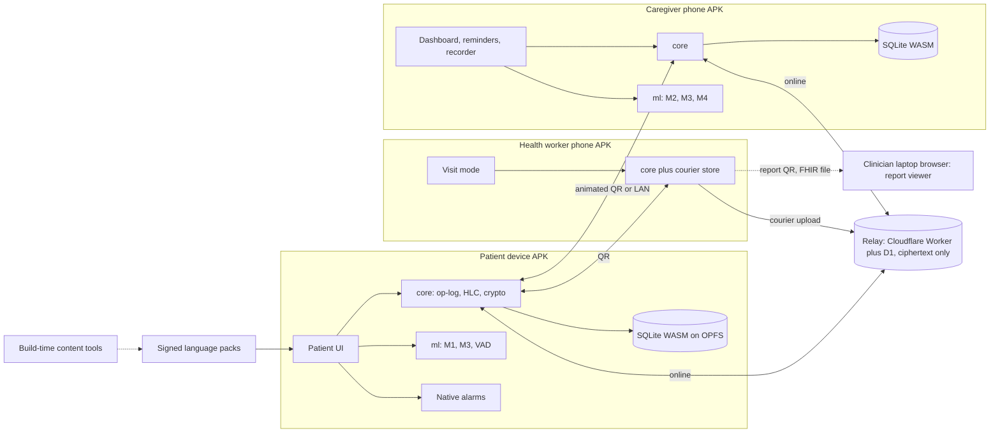

# Hillpath: implementation plan (SIH 2026, PS 26003)

Plan version 1.0, written 2026-09-21. Project root: `D:\dementia\dementia-sih26-v2`. Old project `D:\dementia\dementia-sih261003-marc` is a read-only idea source.

## 0. Front matter

### 0.1 Executive summary

1. Hillpath is an offline-first memory-support and cognitive-stimulation app for people living with dementia in North East India, their families, community health workers and clinicians.
2. Targets: Android APK (phone, tablet), laptop browser (same web build), public landing page.
3. Six signature features: family-voice prompts with few-shot voice answers, a zero-data sync ladder, an honest care forecast, a 12-month simulation "time machine", a life-story library, and a health-worker visit that ends in a clinician report.
4. Real ML replaces the old threshold rule: a Bayesian ability model with Thompson-sampling difficulty (M1), ordinal staging with conformal sets (M2), trend forecasting and change detection with a separate delirium path (M3).
5. The bridge problem is stated, not hidden: clinical datasets train staging only through in-app analogues of validated instruments; game telemetry feeds personal models; linking the two needs a clinical pilot (Roadmap).
6. Every claim carries a tag: Implemented, Simulated or Roadmap. No diagnosis. No invented metrics.
7. Language tiers are visible in the UI; machine-drafted text is labelled; family and native-speaker recordings override synthetic voices.
8. Four stack bets, each with a 1-day spike and a boring fallback.
9. P0 (shippable demo) completes by 2026-11-08 (end of week 6); P1 by 2026-11-29; P2 plus buffer by 2026-12-20.
10. Blocking before any code: SIH requires a 6-member same-college team with at least one female member, and the guideline copy found states an idea deadline of 15 Sept 2026 (section 0.7).

### 0.2 Product name

| Candidate | Check done 2026-09-21 | Verdict |
|---|---|---|
| Hillpath | One web search: no health or app product found. hillpath.com resolves; hillpath.app and hillpath.in have no DNS record; npm name free. Nearby mark: Hillrom (medical devices). | Chosen |
| Kinward | kinward.com and kinward.app resolve; no health product found; "ward" reads as hospital ward | Rejected |
| Homefield | .com, .app, .in all resolve | Rejected |
| Tendwell | .app resolves; reads as a corporate wellness brand | Rejected |
| Riverstone Care | riverstonecare.com resolves; "Care" suffix common in US care chains | Rejected |

Hillpath is a plain English compound. No meaning in any North East language is claimed. Human task H-10 runs an IP India trademark search before public launch. The registered-trademark symbol is not used.

### 0.3 Status legend

| Tag | Meaning |
|---|---|
| Implemented | Runs in the build on real inputs |
| Simulated | Runs, but on synthetic data from the simulator (M5); UI shows a "Simulated data" ribbon |
| Roadmap | Designed, not built in this window |
| Target | A number we aim for, not a measured result |
| P0 / P1 / P2 | Weeks 1-6 / 7-9 / 10-12 |

### 0.4 Assumptions

| ID | Assumption (default chosen) | Change cost |
|---|---|---|
| A1 | The user can form or join a 6-member team and get SPOC nomination; if the SIH idea window has closed, the plan still produces a portfolio-grade prototype | High: submission pack changes |
| A2 | Grand finale is in December 2026 (guidelines: "proposed to be organized in December 2026"); build ends 2026-12-20 | Medium: cut lines apply |
| A3 | Demo hardware: one Android 12+ phone, one Android tablet, one borrowed 3 GB RAM Android phone, the Windows laptop | Low |
| A4 | No native-speaker reviewers at start; recruited from week 0 | Medium |
| A5 | LASI-DAD access via Gateway to Global Aging registration succeeds within 3 weeks; NACC needs a faculty sponsor | High for M2: falls back to Simulated |
| A6 | The project is non-commercial, so CC BY-NC models (MMS-TTS, NLLB) are usable for drafts | Medium: swap to MIT or Apache models |
| A7 | The user holds rights to the hero clip; provenance is unverified (the URL pattern suggests a generative-video service) | Medium: replace footage |
| A8 | A free Cloudflare account and a GitHub account are available | Low |
| A9 | English and Hindi are bridging languages for health workers and reviewers | Low |
| A10 | Laptop has 15.4 GB RAM and no confirmed GPU; all training is CPU-only | Low |
| A11 | Old-project translations (9 languages) are unverified machine text; they enter as Tier 2 at most, and the old "Nyishi" story text is discarded | Low |

### 0.5 Logged disagreements with fixed decisions

| ID | Decision | Disagreement | Cost of complying | Action |
|---|---|---|---|---|
| DIS-1 | D2 colours | Spec uses pure #000000 and #FFFFFF; taste-skill bans both | Slightly harsh contrast | Comply: #FFFFFF is required for the white-sky blend; #000000 kept for spec fidelity on landing only |
| DIS-2 | D2 and taste-skill dark mode | taste-skill mandates dark mode; the footage has a pure white sky that only blends into white | Dark-mode users get a light page | Landing locked to light with `color-scheme: light`; app surfaces support dark and high-contrast |
| DIS-3 | D3 | Full-page scroll-scrubbed video adds weight and motion for an audience that includes older family members | About 3 build days and a budget risk | Comply with strict fallbacks and a pause control |
| DIS-4 | D8 | Four bets is the ceiling, not a target; I would ship two | Integration time | Comply; each bet has a spike and a fallback |
| DIS-5 | Appendix A `top: 300px` | On landscape phones under 600 px tall, 300 px leaves little video | Small visible video area | Kept at all sizes; logged, not changed |
| DIS-6 | PS R1 "memory improvement" | NICE NG97 advises against offering cognitive training to treat mild to moderate Alzheimer's disease | Weaker marketing claim | Games are framed as cognitive stimulation and engagement; no improvement claim |

### 0.6 Environment baseline (run 2026-09-21)

| Tool | Found | Status | Phase 0 task |
|---|---|---|---|
| node | v22.23.1 | OK (Capacitor 8 needs 22+) | none |
| pnpm | 9.15.9 (latest 12.5.1) | OK | T0.2 pins pnpm 12.5.1 via `packageManager` |
| python | 3.13.5 | OK | none |
| uv | 0.12.5 | OK | none |
| git | 2.50.1.windows.1 | OK; project folder is not a repo | T0.2 `git init` |
| ffmpeg | 2025-07-17 essentials (gyan.dev), on PATH | libx264, libx265, libvpx-vp9, libaom-av1, libwebp, libopus; filters reverse, scale, zscale, tpad | none |
| java | 1.8.0_401 on PATH, JAVA_HOME unset | Too old for Android Gradle | H-05 then T0.4 sets JAVA_HOME to Android Studio JBR |
| adb | missing | Missing | H-05 Android Studio (2025.2.1 or newer) with SDK Platform 36 and platform-tools |
| ANDROID_HOME | unset | Missing | T0.4 sets it to `%LOCALAPPDATA%\Android\Sdk` |
| winget | missing | Installers are manual | H-05 |
| RAM | 15.4 GB | OK | none |

taste-skill: installed 2026-09-21 at project scope with `npx skills add https://github.com/Leonxlnx/taste-skill --skill design-taste-frontend`; files at `.agents\skills\design-taste-frontend\SKILL.md` with a junction in `.claude\skills`. Read in full. The `full-output-enforcement` variant was not installed; agents writing long files follow the chunked-write rule in section 11 instead.

### 0.7 SIH facts that change the plan

Source: SIH 2026 Guidelines PDF (copy hosted by a college at sih-uit.vercel.app, extracted 2026-09-21) and sih.gov.in FAQ.

| Fact | Consequence |
|---|---|
| Teams have exactly 6 members from one college, at least one female; only internal-hackathon teams are nominated by the college SPOC | Blocking question Q1; human task H-01 on day 1 |
| Guidelines: last date for team nomination and idea submission "is till 15th Sept 2026 only"; third-party blogs say 30 Sept 2026 | Blocking question Q2; verify on the portal on day 1 |
| Idea selection criteria: novelty, complexity, clarity and details in the prescribed format, feasibility, practicability, sustainability, scale of impact, user experience, potential for future work | Section 1.3 maps each criterion |
| Grand finale offline at nodal centres, proposed December 2026; 4-5 teams per problem statement may be selected | Demo must run with no venue internet |
| Solutions "must be new and must not have been present in any previous event" | RISK-13: confirm the old MindCare AI was not shown at another event |
| Third-party claim (unverified): demo video and narration must not be AI-generated | Video is screen capture of the real app with the team's own narration |

### 0.8 Blocking open questions

| ID | Question | Default until answered |
|---|---|---|
| Q1 | Is there a nominated 6-member team (same college, at least one female member) with a SPOC? | Build proceeds; submission pack waits |
| Q2 | Was an idea submitted for PS 26003 before the portal deadline (15 Sept per guidelines, 30 Sept per blogs)? | Treat as open until the portal says otherwise |
| Q3 | Does the user hold written rights to the hero clip, and is it generated footage? | Build the pipeline; keep the clip out of the SIH video |
| Q4 | Answered 2026-09-21: no dataset that needs an application will be used | M2 trains on simulator output only and is tagged Simulated everywhere |
| Q5 | Answered 2026-09-21: English only, no native speakers | Every other language stays T0 Planned; see 0.9 |

### 0.9 Scope changes after user answers (2026-09-21)

The user asked to finish the project as fast as possible using this plan, with two limits: no datasets that need an application, and English only with no native speakers.

| Area | Change | Honest consequence |
|---|---|---|
| Data (5.4) | LASI-DAD, NACC, DementiaBank, ADNI and OASIS are dropped. H-03, H-04, RISK-02 and the NACC parts of T4.9 are retired. | M2 is trained and evaluated only on simulator output. It shows the pipeline works and is tagged Simulated in the UI, model card and deck. It says nothing about real people. M3 stage transitions use an assumed matrix, tagged assumed. |
| Languages (8) | English is the only Tier 1 language. All 13 others are T0 Planned in the picker. H-06, T2.C5 and native-reviewer work are retired. Family voice recordings in English stay. | R3, R4 and O3 are met structurally (tier system, voice-override path) but not in practice. SF1 is reduced to English family-voice prompts. The deck must say so. |
| Speed choices (ADR-001) | Dexie replaces SQLite WASM; a small hash router replaces TanStack Router; native accessible elements replace React Aria; typed English string modules replace Fluent; SVG charts replace uPlot. | Each was a listed fallback or a low-risk swap. Bets BET-1 and BET-4 are not attempted. |
| Android | The APK needs Android Studio and a JDK 21 (H-05). An agent cannot install them. The Capacitor project is scaffolded; the build waits for H-05. | No device test of alarms or camera until the user installs the toolchain. |

### 0.10 Build status (2026-09-22)

P0 and P1 are built, and most of P2. Read `docs/status.md` for the requirement-by-requirement state with evidence, `docs/known-gaps.md` for what does not work, and `README.md` for commands.

Differences from this plan, beyond 0.9:

| Plan | Built | Why |
|---|---|---|
| 10 activities, 5 in P0 | All 10: the original 5 (Pairs at Home, Faces and Names, Story Time, Routine Steps, Find It) plus Sound Match, Pattern Weave, Places I Know, and the unscored Memories and Music | Built across this pass, not staged by phase |
| Time machine in P1 | Built early, in the app at `#/demo` | The simulator was ready and it is the strongest demo beat |
| Sudden-change rule per domain | A pooled rule for sparse play, z above 3.5, plus the family checklist | The per-domain rule needs daily data; measured sensitivity 15 of 30 against the current ten-activity roster (target 0.9 not met; was 22 of 30 when first tuned against five activities, see `docs/known-gaps.md` item 9) |
| M2 trained on LASI-DAD, then NACC | Trained on simulator output, tagged Simulated everywhere. A monotone LightGBM and an EBM were compared against it under the fixed selection rule (5.8); the shipped model kept its place | Decision Q4 |
| Relay client in the sync ladder | Relay server and client both built and tested; also courier mode with a write-only drop token, and LAN WebRTC by QR-exchanged SDP. Not deployed to a public Cloudflare Worker | Time; deploy needs H-New in `docs/HUMAN_TASKS.md` |
| Animated fountain-coded QR | Looping QR pages for short records, fountain (LT) frames above about 1200 characters, gzip first | Simpler for short records, robust for long ones |
| Visit mode, FHIR, doctor report, voice answers, postcards | Built. Visit mode has a spoken and pictured monthly check; the report is Ed25519-signed and FHIR-structural-checked, not HL7-validated (no Java 17+ on this machine) and claims no ABDM profile; voice answers use personal keyword spotting, accuracy measured on synthetic speech only; postcards are short voice clips (about 15 seconds) with an optional photo | P1 and P2, finished in this pass |
| Caregiver burden check, PIN gate, time-of-day view, language-pack manager, orientation board | Built. The burden check is Hillpath's own six items, labelled not validated, answers device-only; the PIN is PBKDF2 with slower retries, plus an optional platform passkey; the time-of-day view is Simulated (F24); the language-pack manager is signed and tiered but ships no language beyond English; the orientation board hides a new festival until a family member approves it | P2, finished in this pass |
| Landing scrub technique spike S-LAND | Canvas image sequence chosen without measuring the two alternatives | Time; numbers in `docs/landing-media.md` |
| Sections 6 and 7 of the landing page use product screenshots | Real captures of the built app, all 10 activities, produced by `apps/app/scripts/capture-landing.mjs` | As specified |

## 1. Product thesis and jury strategy

### 1.1 Thesis

A person living with dementia in a hill village should hear a familiar voice, in their own language, on a device that works without a signal, and the people who care for them should get honest signals, not fake precision. Hillpath wins on three proofs a juror can see in three minutes: it works in airplane mode between two devices, it speaks in family voices in languages no engine supports, and its ML shows uncertainty and refuses to diagnose.

### 1.2 Three-minute demo narrative

| Time | Screen | What the juror sees | Proof |
|---|---|---|---|
| 0:00-0:15 | Laptop, landing | Scroll the valley journey; headline | Craft, R11 |
| 0:15-0:50 | Tablet, airplane mode | Patient home; grandmother's recorded Assamese voice asks "Who is this?"; answer by voice or tap; "why this level" | R1, R2, R3, R8 |
| 0:50-1:15 | Tablet to phone, both airplane mode | Animated code on tablet, phone scans, caregiver chart updates | R7, ES5, ES6 |
| 1:15-1:40 | Phone | Native reminder fires in daughter's voice; missed-dose flow says "Do not take an extra dose" | R5, safety |
| 1:40-2:15 | Laptop, time machine | 12 simulated months in 60 s; forecast band widens; month 7 abrupt drop routes to "health check today", not "decline" | M2, M3, honesty |
| 2:15-2:45 | Phone to laptop | Health-worker visit finishes; clinician laptop scans a code and opens the one-page report and FHIR file | R6, ES3, O1 |
| 2:45-3:00 | Slide | Implemented, Simulated, Roadmap list and top limitations | Defensibility |

### 1.3 SIH criteria

| Criterion | How Hillpath meets it | Evidence shown |
|---|---|---|
| Novelty | Few-shot voice answers in unsupported languages; zero-data sync; conformal staging | Live demo moments 0:15, 0:50, 1:40 |
| Complexity | Encrypted op-log sync, on-device Bayesian models, scroll-scrubbed media pipeline | Architecture slide, model card |
| Clarity and format | SIH PPT template, one message per slide | Deck outline section 14.3 |
| Feasibility | P0 already built by week 6 on free tiers | APK on judges' table |
| Practicability | Runs on a 3 GB phone, no data plan, health-worker mode | Device matrix results |
| Sustainability | Free tiers, open licences, community language packs | Stack table, section 8 |
| Scale of impact | Language-pack model scales to new languages without new engines | Language matrix |
| User experience | Elder rules (22 px text, 64 px buttons, errorless, no timers) | Accessibility report |
| Future work | Clinical pilot and ethics path named | Section 14.6 |

## 2. Requirements traceability matrix

Feature IDs are defined in section 4, tests in section 13. Maturity is the P0 state.

| Req | Requirement | Features | Acceptance test | Phase | P0 maturity |
|---|---|---|---|---|---|
| R1a | Memory activities | F07 (G1, G2, G3) | AT-01: each game completes a 5-round session offline and writes trials | P0 | Implemented |
| R1b | Attention and concentration | F07 (G7, G6) | AT-01 for G7; G6 in P1 | P0 | Implemented |
| R1c | Daily routine recall | F07 (G4), F23 | AT-02: G4 uses caregiver-entered routine steps | P0 | Implemented |
| R1d | Pattern and object recognition | F07 (G1, G6, G8) | AT-01 for G1; G6, G8 in P1 | P0 | Implemented |
| R1e | Emotional and mental engagement | F07 (G3, G9, G10), F05 | AT-03: unscored activities log engagement only, never accuracy | P1 | Roadmap at P0 except G3 |
| R2 | ML adapts difficulty | F03 (M1) | AT-04: in simulation, M1 keeps more rounds in the 0.75-0.85 success band than the old threshold engine (paired test) | P0 | Implemented (evaluated in Simulated) |
| R3 | Multilingual voice interaction | F01, F13 | AT-05: every patient screen plays a prompt in the selected language or shows the tier notice; AT-06 KWS accuracy spike | P0 prompts, P1 KWS | Implemented (prompts) |
| R4 | Culturally familiar themes and sounds | F05, F07 (G5, G6, G8), F13 | AT-07: every cultural asset has a source or a review flag in `content/cultural-register.json` | P0 | Implemented |
| R5 | Reminders: medicine, hydration, activities, appointments | F08 | AT-08: reminder fires on a locked Android device in airplane mode within 1 min of schedule with exact alarm granted; AT-09 missed-dose flow never offers a second dose | P0 | Implemented |
| R6 | Caregiver and health-worker monitoring | F10, F06 | AT-10: dashboard shows sessions, abilities with intervals, adherence and alerts from synced data | P0 dashboard, P1 visit mode | Implemented |
| R7 | Offline, low connectivity | F02, F21 | AT-11: airplane-mode end-to-end script passes (section 13.3) | P0 | Implemented |
| R8 | Mobile and tablet, elderly-friendly | F11, F12 | AT-12: patient rules in section 9.4 pass automated and manual checks | P0 | Implemented |
| R9 | Long-term engagement, wellbeing, social | F05, F07 (G9, G10), F17 | AT-13: postcard sent from family device plays on patient device after sync | P1 | Roadmap at P0 |
| R10 | ML stage and severity prediction | F03 (M2, M3), F18 | AT-14: M2 metrics report with subject-level split and conformal coverage; AT-15 abrupt-change path triggers in simulation scenario S5 | P0 | Implemented if data arrives, else Simulated |
| R11 | Landing page | F19 | AT-16: landing acceptance gate (section 10.10) | P0 | Implemented |
| R12 | Quality asks | F19, F22, CI | AT-17: CI checks for meta, links, placeholders, avoid-list, em dash | P0 | Implemented |
| ES1 | Adaptive games | F07, F03 | AT-01, AT-04 | P0 | Implemented |
| ES2 | Voice multilingual interface | F01, F13 | AT-05 | P0 | Implemented |
| ES3 | Performance tracking dashboard | F10, F03 | AT-10 | P0 | Implemented |
| ES4 | Caregiver monitoring and alerts | F09 | AT-18: tiered alerts batch, snooze and escalate per rules in section 3.3 | P0 | Implemented |
| ES5 | Offline synchronisation | F02 | AT-11, AT-19: relay sync converges after 3 devices edit offline | P0 | Implemented |
| ES6 | Secure patient data | F14, F15, section 6 | AT-20: relay stores only ciphertext; consent withdrawal stops sharing | P0 | Implemented |
| ES7 | Simple accessible UI | F11, F12 | AT-12, AT-21 axe clean on all routes | P0 | Implemented |
| O1 | Early cognitive intervention | F18, F03, F06 | AT-22: when M2 set includes MCI or higher, the app recommends a clinical check in plain words | P0 | Implemented |
| O2 | Quality of life | F05, F08, G9, G10 | AT-13, AT-08 | P1 | Roadmap at P0 |
| O3 | Digital healthcare access across NER | F13, F02, F06, F19 | AT-23: language picker shows tier for all 14 listed languages; AT-11 | P0 | Implemented |

## 3. Users, roles and journeys

### 3.1 Roles

| Role | Device | Needs | Capabilities (signed into device key) |
|---|---|---|---|
| Person living with dementia (patient) | Tablet or phone, often shared | One action per screen, familiar voice, no pressure | play, confirm_reminder, send_help, view_own_sharing |
| Family caregiver (primary, secondary, remote) | Own phone | Reminders, activity view, alerts, recordings | manage_reminders, manage_meds_list, record_voice, view_dashboard, manage_consent |
| Community health worker (ASHA, ANM) | Own phone | Low-literacy visit flow, monthly check, courier sync | run_instruments, view_summary, courier_sync |
| Clinician (PHC medical officer, teleconsult doctor) | Laptop browser | One-page summary, uncertainty, raw scores | view_report (per shared report only) |

### 3.2 Journeys

| Journey | Steps | Screens | Phase |
|---|---|---|---|
| J1 Morning | Wake reminder in daughter's voice; confirm medicine with one tap; one suggested activity; natural stop after 10 min | Patient home, reminder, game, "well done for today" | P0 |
| J2 Setup | Caregiver creates care circle, pairs tablet by two QR scans, records 10 core prompts, enters medicines as written by the doctor, sets hydration target (clinician override field) | Caregiver onboarding | P0 |
| J3 Weekly review | Caregiver sees activity, ability bands, adherence, alerts, "why" notes | Dashboard | P0 |
| J4 Health-worker visit | Home visit mode: consent check, monthly instruments, confounder checklist, finish, courier sync, report QR | Visit mode | P1 |
| J5 Clinician review | Scan report QR or open shared PDF and FHIR JSON | Report viewer | P1 |
| J6 Remote family | Grandson records a postcard; it plays after the next sync; async co-play round | Family app | P1 |

### 3.3 Alert routing

| Tier | Examples | Route | Batching and snooze |
|---|---|---|---|
| Info | Weekly activity summary, postcard arrived | Daily digest to caregivers at a chosen time (default 19:00) | Always batched; no sound |
| Attention | Medicine not confirmed 60 min after its window; hydration under target by 18:00; gradual decline flag (M3); patient device not synced for 3 days | Primary caregiver; secondary after 4 h unacknowledged; health worker only if the caregiver forwards it | Max 3 pushes per circle per day; duplicates merged; snooze 1 h or until tomorrow |
| Urgent | Abrupt-change path (M3); patient pressed "I need help"; caregiver ticks a stroke sign; caregiver reports a fall | All caregivers and the consented health worker at once; after 15 min unacknowledged, the phone offers an SMS to the escalation contact (native intent, user presses send) | Never batched, never snoozed; acknowledging requires an action choice: called, visiting, false alarm |

Offline devices receive alerts at next sync; the patient device also rings locally for urgent alerts so people in the house hear it. Clinicians are never paged by the app.

### 3.4 Consent and capacity

| Rule | Implementation |
|---|---|
| The person is the data principal | Consent screen speaks to the person first, in voice and pictures, with a teach-back question |
| Supported decision | Method recorded as `self` or `self_supported` with supporter identity |
| Cannot decide even with support | Method `guardian_verified` only when a lawful guardian is verified as DPDP Rule 11 describes (appointed by a court, designated authority or local level committee); otherwise `family_supported_unverified`, which limits sharing to the care circle and flags the record. Legal review is Roadmap |
| Purposes, each separate | P-local (required to run), P-family, P-health-worker, P-clinician (per report), P-relay (ciphertext only), P-research (off; Roadmap) |
| Withdrawal | Any purpose revocable in two taps; revocation is an op; device removal rotates the circle key |
| Visibility | "Who can see my information" screen with names and faces, readable by the patient |

## 4. Signature features, supporting features, game catalogue

### 4.1 Shortlist scores

33 candidates were brainstormed and scored in a scratch table (not reproduced). Weights: jury wow 30, problem fit 20, feasibility 20, defensibility and honesty 15, offline 15. Scores 1-5, weighted to 100.

| Candidate | Wow | Fit | Feas | Def | Off | Score | Decision |
|---|---|---|---|---|---|---|---|
| Zero-data sync ladder | 5 | 5 | 3 | 5 | 5 | 92 | SF2 |
| Voice in any language | 5 | 5 | 3 | 4 | 5 | 89 | SF1 |
| Visit to report | 4 | 5 | 4 | 5 | 4 | 87 | SF6 |
| Honest care forecast | 4 | 5 | 3 | 5 | 5 | 86 | SF3 |
| Time machine simulation | 5 | 3 | 4 | 4 | 5 | 85 | SF4 |
| Life-story library and postcards | 4 | 5 | 4 | 4 | 4 | 84 | SF5 |
| Caregiver burden check | 2 | 3 | 4 | 4 | 5 | 67 | Supporting F17, P2 |
| Sundowning forecast | 4 | 3 | 2 | 2 | 5 | 65 | Supporting F24, P2, Simulated |
| Offline maps and safe zone | 4 | 3 | 2 | 3 | 4 | 65 | Roadmap |
| Passkeys and consent ledger | 2 | 4 | 3 | 5 | 3 | 64 | Ledger kept as F14; passkeys P2 |
| On-device LLM reminiscence chat | 5 | 3 | 1 | 1 | 3 | 58 | Struck: unsafe, infeasible on 3 GB |
| Medicine strip scan | 3 | 3 | 2 | 2 | 4 | 56 | Roadmap |

### 4.2 Signature feature cards

**SF1 (F01) Voice in any language.** P0 prompts and timing capture, P1 voice answers.
- Story: As a daughter in Aizawl, I record each prompt once so my father hears reminders and questions in Mizo in my voice, and he can answer by saying one of four words.
- Technology: voice packs of Opus audio keyed by message ID override any synthetic voice; synthetic drafts pre-rendered at build time only where a model lists the language (section 8); answers by few-shot keyword spotting: Silero VAD (via `@ricky0123/vad-web`) segments speech, an embedding is compared to 3 enrolled samples per word by cosine distance with a rejection threshold, and the match is confirmed by a tap. Candidate embeddings: A) MFCC with dynamic time warping in TypeScript; B) the few-shot multilingual KWS embedding of Mazumder et al. 2021 converted to ONNX (licence unverified). VAD also yields speech-timing features (response latency, pause ratio).
- Spike (1 day): 4 words x 3 enrolment samples x 2 speakers (Assamese, English), 40 test utterances each, quiet room and TV noise, at 50 cm. Pass: 90% top-1 in quiet with 5% or fewer false accepts (Target).
- Fallback: tap answers; voice output only.
- 10-second moment: the grandmother's recorded voice asks "Who is this?"; the patient says the name; the right photo lights up.
- Risk: dysarthria, noisy homes, single-word answers unnatural. Tap is always available.

**SF2 (F02) Zero-data sync ladder.** P0 relay and static QR; P1 animated QR, courier, SMS intent; P2 LAN WebRTC.
- Story: As an ASHA in a village with no network, I scan the patient's tablet and carry this week's encrypted records on my phone; they upload when I reach the PHC, and I cannot read families I am not part of.
- Technology: encrypted op-log (section 6.3); rungs: 1) relay on Cloudflare Workers with D1 when online; 2) animated QR using fountain-coded UR frames (`@ngraveio/bc-ur` 1.1.13) scanned with ML Kit on Android and zxing-wasm on laptop; 3) courier mode, where any paired health-worker phone stores ciphertext for other circles and forwards it; 4) SMS intent (`sms:` URI) for urgent alert text only; 5) LAN WebRTC with QR-exchanged session descriptions (P2).
- Spike (1 day): static paged QR with 50 ops; animated QR with a 20 KB payload at 8 fps, phone to laptop and phone to phone. Pass: 20 KB in 20 s or less (Target).
- Fallback: relay only, plus an encrypted file sent through the Android share sheet.
- 10-second moment: both devices in airplane mode, the tablet shows a moving code, the phone scans, the chart updates.
- Risk: low-end camera focus and screen glare; payload growth. Mitigation: incremental ops since last acknowledged vector.

**SF3 (F03) Honest care forecast.** P0.
- Story: As a son in Guwahati, I see that my mother's answers look similar to people in a "mild or MCI range, not certain" band, with three reasons in Assamese and a button to book a check-up.
- Technology: M1 to M4 (section 5) in TypeScript; staging coefficients as JSON; conformal sets; Kalman trend; change-point detection; explanation templates in Fluent.
- Spike (1 day): train the ordinal model on simulator output, export JSON, evaluate in TS; parity with Python within 1e-6 and inference under 5 ms (Target).
- Fallback: show abilities and trends only; staging hidden.
- 10-second moment: tap "Why?" on the band; three plain reasons and "Ask for a check-up" appear.
- Risk: over-trust. Mitigation: wording rules, abstention, clinician detail view.

**SF4 (F04) Time machine.** P1 (Simulated).
- Story: As a juror, I watch 12 simulated months pass in 60 seconds and see forecast bands, alerts and the delirium path behave.
- Technology: `packages/sim` runs in a Web Worker, writes to an isolated demo database, every screen shows the "Simulated data" ribbon.
- Spike (1 day): 365 days for one persona in under 10 s on the 3 GB phone with UI responsive (INP under 200 ms, Target).
- Fallback: replay a precomputed trace JSON.
- 10-second moment: at month 7 a sudden drop produces "Please arrange a health check today" instead of a decline message.
- Risk: simulation mistaken for evidence. Mitigation: ribbon, voice-over, model card.

**SF5 (F05) Life-story library and family postcards.** P1.
- Story: As a grandson working in Bengaluru, I send a voice postcard; my grandfather hears it after the next sync, and we each play the same "Places I Know" round.
- Technology: encrypted media store; caregiver-approved facts as structured records (person, relation, place, year, story, "do not ask about" flag); prompts are Fluent templates filled only from approved facts; no generated text reaches the patient; co-play shares round seeds through sync.
- Spike (1 day): 10 facts, 5 photos, 2 postcards; measure relay payload; render prompts in English, Assamese and Hindi with correct grammar variants.
- Fallback: photo album with recorded captions.
- 10-second moment: a postcard arrives; one tap plays the grandson's voice over a photo of the family courtyard.
- Risk: grief triggers and photo privacy. Mitigation: "do not ask about" flags, per-item consent.

**SF6 (F06) Visit to report.** P1.
- Story: As an ASHA who reads little English, I follow picture and voice steps for the monthly check; the PHC doctor gets a one-page summary in English and Assamese and a FHIR file.
- Technology: home visit mode (icons, voice, tap counters); FHIR R4 Bundle with Patient, QuestionnaireResponse, Observation (LOINC 71945-0 where AD8 is used), RiskAssessment for the stage set, Composition; profile alignment with the NRCeS FHIR IG for ABDM v6.5.0 (mapping to a document type verified in the spike); one-page PDF rendered on canvas (correct Bengali-Assamese shaping) and signed, with an Ed25519 signature in a verification QR.
- Spike (1 day): bundle from simulated data validated by the HL7 FHIR validator (runs on the Android Studio JDK); PDF with Assamese text checked by eye against the HTML render.
- Fallback: PDF only; FHIR JSON labelled "not validated".
- 10-second moment: "Finish visit" shows a QR; the doctor's laptop scans it and opens the report.
- Risk: ABDM conformance depth; PDF text is an image in non-Latin scripts (accessible HTML version shipped alongside).

### 4.3 Supporting features

| ID | Feature | Phase | Maturity at its phase |
|---|---|---|---|
| F07 | Game engine and catalogue (4.4) | P0 (G1, G2, G3, G4, G7), P1 rest | Implemented |
| F08 | Reminders: medicine, hydration, activity, appointment; native alarms; missed-dose flow | P0 | Implemented |
| F09 | Alert tiers, batching, escalation | P0 | Implemented |
| F10 | Caregiver dashboard with accessible charts and tables | P0 | Implemented |
| F11 | Patient home: one action per screen, voice on every screen | P0 | Implemented |
| F12 | Accessibility settings: text scale to 150%, contrast, reduce motion, TalkBack labels | P0 | Implemented |
| F13 | Language-pack manager, tiers, review workflow | P0 tiers, P1 manager | Implemented |
| F14 | Consent ledger and hash-chained audit log | P0 | Implemented |
| F15 | QR pairing, device keys, capability tokens | P0 | Implemented |
| F16 | Caregiver passkeys (WebAuthn) where the WebView supports them | P2 | Roadmap until spike |
| F17 | Caregiver burden check (free-licence instrument chosen in H-09) | P2 | Implemented if licence clears |
| F18 | In-app instruments: IQCODE-16 informant, ADL and IADL items, animal fluency with tap counter, delayed word recall, orientation, depression screen, vision and hearing checks | P0 | Implemented |
| F19 | Landing page | P0 | Implemented |
| F20 | Simulator and evaluation harness | P0 | Simulated |
| F21 | Offline shell: APK bundles all assets; laptop build uses a service worker | P0 | Implemented |
| F22 | Loading, empty, error, offline state system | P0 | Implemented |
| F23 | Orientation board: day, date, season, next festival for the person's community | P1 | Implemented |
| F24 | Time-of-day pattern view (sundowning) | P2 | Simulated |
| F25 | Offline maps and safe zone | Roadmap | Roadmap |
| F26 | Medicine strip scan | Roadmap | Roadmap |

### 4.4 Game catalogue

Non-claim, shown in app and deck: these activities do not cure, stop or reverse dementia. NICE NG97 recommends offering group cognitive stimulation therapy and considering group reminiscence therapy for mild to moderate dementia, and advises against offering cognitive training to treat mild to moderate Alzheimer's disease. Hillpath activities follow stimulation, reminiscence and errorless-learning principles and aim at engagement and wellbeing.

Defaults for every game: untimed, no red crosses or buzzers, a wrong choice gently reveals the right one, a session ends by 10 minutes with a natural closing line, no looping animation.

| ID | Game | Approach | Domain | Parameters M1 controls | Input | Minutes | Feedback | Phase |
|---|---|---|---|---|---|---|---|---|
| G1 | Pairs at Home: match familiar objects (gamosa, kettle, sickle) | Cognitive stimulation, multisensory | Visual short-term memory | Pairs 2-8; distractor similarity; preview seconds; grid layout | Tap | 3-5 | Card turns back slowly, correct pair glows | P0 |
| G2 | Faces and Names: family photos | Errorless learning, spaced retrieval | Associative memory, recognition | Options 2-4; retrieval interval; cue level (initial letter, voice cue) | Tap, voice (P1) | 3-5 | Name spoken warmly after any answer | P0 |
| G3 | Story Time: short local stories read by a familiar voice | Cognitive stimulation, reminiscence | Episodic verbal memory, language | Sentences 2-6; questions 1-4; options 2-4; delay | Tap, voice (P1) | 5-7 | Story line replayed on a miss | P0 |
| G4 | Routine Steps: order the steps of a real routine (making tea, cooking rice, getting ready for prayer) from caregiver photos | Montessori-based, errorless | Procedural memory, daily routine recall | Steps 3-6; picture only or picture plus word; hint level | Tap, drag | 3-5 | Step slides into place when chosen right, otherwise a hint appears | P0 |
| G5 | Sound Match: familiar sounds (rain on a tin roof, rooster, local instruments with clear rights) | Multisensory, music | Auditory recognition | Options 2-4; similarity; replays | Tap | 3-5 | Sound replays with its picture | P1 |
| G6 | Pattern Weave: complete a textile motif (gamosa border, phanek stripes, puanchei, Naga shawl bands; each flagged for community review) | Cognitive stimulation | Pattern recognition, attention | Pattern length; motif complexity; choices | Tap | 3-5 | Motif completes on the correct choice | P1 |
| G7 | Find It: find an object in a home or market scene | Cognitive stimulation | Attention, concentration | Set size; distractor similarity; target count | Tap | 3-5 | Found item is circled; after 3 misses it gently pulses | P0 |
| G8 | Places I Know: caregiver photos of the market, church, namghar, temple, river ghat | Reminiscence, orientation | Recognition, orientation | Options 2-4; cue level | Tap, voice (P1) | 3-5 | Place name spoken with the photo | P1 |
| G9 | Life Story: talk about a photo with a prompt from approved facts | Reminiscence therapy | Emotional engagement, language | None scored | Voice, tap | 5-10 | No scoring; thanks and a related photo | P1 |
| G10 | Song Circle: family-provided or rights-cleared songs with lyrics | Music-based activity | Emotional engagement, social | None scored | Listen, sing | 5-10 | No scoring | P1 |

## 5. ML system design

### 5.1 Scope and non-claims

- Screening support and decision support only. The app never states a diagnosis. Wording: "answers look similar to people in the ___ range"; action wording: "please arrange a check with a doctor or health worker".
- The app never says a person is fine. Negative wording: "No changes found in these activities. This is not a medical check."
- Synthetic data is labelled wherever it appears (records carry `synthetic: true`; screens show the ribbon; charts carry "Simulated" in the title).
- Changes to the candidate approach, with reasons: item difficulty comes from a linear item model because items are generated, not fixed; domains share a correlated Gaussian posterior, so one on-device update is closed-form; the population prior is trained on Indian data (LASI-DAD) with US data (NACC) only for external validation and transition rates; Thompson sampling is constrained by errorless rules; the stage forecast (population multi-state model) stays separate from the personal trend; acute episodes are masked out of trend estimation; a Gaussian process trend, federated learning and an on-device language model are rejected for this window.

### 5.2 Problem formulation

| ID | Task | Target | Inputs | Output | Decision supported | Seen by | P0 maturity |
|---|---|---|---|---|---|---|---|
| M1 | Ability per domain and next-item difficulty | Latent ability per domain; next design with predicted success near 0.8 | Trial outcomes, response times, item design vectors | Mean and 90% interval per domain; next design; "why this level" | Which round to show next | Patient (indirectly), caregiver | Implemented; evaluated Simulated |
| M2 | Severity staging | Ordinal: no impairment, MCI range (CDR 0.5), mild range (CDR 1), moderate or severe range (CDR 2 or more) | In-app instrument analogues, demographics | Calibrated probabilities; 90% conformal set of contiguous stages; abstain reason | Whether to recommend a clinical check | Caregiver, health worker, clinician | Implemented if LASI-DAD arrives by the end of week 3; else Simulated |
| M3 | Forecast and change detection | Composite ability at 3, 6, 12 months; stage distribution at 12 months; change points; abrupt-change flag | M1 history, M2 output, caregiver checklist | Forecast band with "prior-dominated" flag; change alerts; urgent path | Monitoring cadence; same-day health check | Caregiver, health worker, clinician | Implemented; evaluated Simulated |
| M4 | Explanations | Faithful plain-language reasons | Exact additive contributions from M2, M1 state | 3 reasons for family; contribution table for clinicians | Trust calibration | All | Implemented |
| M5 | Simulator and evaluation harness | Synthetic patients and telemetry conditional on latent state | Parameter sets with provenance | Traces, datasets, reports | Testing, demo | Team, jurors | Simulated |

### 5.3 The bridge problem

Public clinical datasets hold interviews, informant questionnaires, neuropsychological tests, imaging and clinician ratings. None hold tap sequences or reaction times from these games. A model trained on them cannot read game telemetry. Hillpath therefore splits the problem:

1. Staging (M2) is trained only on variables the app can also collect through in-app analogues of validated instruments (informant questionnaire, animal fluency, delayed word recall, orientation, daily-function items), administered monthly by a caregiver or health worker.
2. Game telemetry feeds only personal models (M1 ability, M3 trend and change detection), referenced to the person's own baseline.
3. The simulator links latent stage to both instrument scores and telemetry, so the full pipeline can be tested; any model that maps telemetry to stage is tagged Simulated.
4. The gap closes only with a clinical pilot that collects in-app instruments, telemetry and clinician ratings from the same people (Roadmap, section 14.6).
5. Mode shift is a known risk even for M2: tablet-delivered analogues differ from face-to-face interviews in LASI-DAD. Until the pilot, M2 output on real users carries the caveat "screening estimate, not validated for app use".

### 5.4 Data

Applications with lead times are submitted on day 1 (H-03, H-04).

| Source | Contents | Access route | Licence and terms | Lead time | Use |
|---|---|---|---|---|---|
| LASI-DAD (Harmonized, Wave 1) | 4,096 adults 60+ across India; HMSE, word list learning and delayed recall, digit span, animal naming, story recall, IQCODE, CSI-D, Blessed, 10/66 informant, ADL, IADL, depression, hearing test; consensus clinical ratings for a subsample (2,528 per the prevalence paper) | Register at g2aging.org, public-use data application, DUA | Free; research use; no redistribution | Unverified; assume 1-3 weeks | M2 training, education-stratified norms, simulator fitting |
| NACC UDS Quick Access File | US ADRC longitudinal visits; CDR, FAQ, NPI-Q, GDS, neuropsychological battery | Online DUA (NACC states about 15 min to sign, data within 48 h); researcher affiliation needed | Research DUA, no redistribution | 2-7 days after sponsor signs | External validation on shared variables; annual stage transition rates for M3 |
| DementiaBank Pitt (TalkBank) | English picture-description speech with diagnosis | Faculty advisor applies for membership, then student access | Research only, IRB compliance form | Unverified; 1-4 weeks | P2 check of pause features only |
| ADNI (LONI IDA) | Imaging, clinical, cognitive | DUA; reviewed in about 2 weeks | Research only | About 2 weeks | Not needed; apply only if NACC is refused |
| OASIS-3 | Imaging with clinical data | Data access form, NITRC account | Non-commercial academic only | Unverified | Not used |
| Kaggle tabular dementia sets | Mixed; some describe themselves as synthetic (unverified per set) | Public | Varies | None | Never used for claims; pipeline smoke tests only |
| Hillpath simulator | Synthetic patients, instruments, telemetry | Generated | Project licence | None | M1, M3 evaluation; M2 fallback (Simulated) |
| Literature parameters | Decline rates, practice effects, delirium course | Papers collected in T2.B1 | Citation | 1 day | Simulator priors; each parameter cited or tagged assumed |

### 5.5 Features

| Feature | In-app capture | Construct | Validated analogue | Used by |
|---|---|---|---|---|
| Age, sex, years of schooling, can read a sentence | Setup form, voice-assisted | Demographics, education | LASI-DAD demographics | M2, norms |
| Informant decline score | IQCODE-16 read to caregiver (icons, voice); licence check H-09; AD8 is the fallback informant tool, reported to clinicians but not used by M2 | Change from 10 years ago | IQCODE in LASI-DAD | M2 |
| Daily-function count | ADL and IADL items answered by caregiver | Function | LASI-DAD ADL, IADL; NACC FAQ (external) | M2 |
| Animal fluency | 60 s timer run by the administrator, who taps once per valid animal named; audio stays on device | Semantic fluency, executive | LASI-DAD animal naming; NACC animals | M2 |
| Delayed word recall | 10 culturally adapted words spoken by a recorded voice; recall after G1 as a filler task; administrator taps words recalled | Episodic memory | LASI-DAD word list delayed recall | M2 |
| Orientation | 4 questions (place, season, time of day, day of week) with pictures | Orientation | HMSE orientation items | M2 |
| Depression screen | Caregiver or health worker asks items (instrument chosen in H-09) | Confounder | LASI-DAD depression items | Abstain rule, M4 |
| Vision and hearing quick checks | Large-letter reading at arm's length; repeat 3 words at normal voice | Confounder | LASI-DAD hearing test (partial) | Abstain rule, game modality weights |
| Trial accuracy, design vector | Every game round | Domain ability | None (personal) | M1 |
| Response time, tap-latency variability, hesitation | Every round, monotonic clock | Processing speed, attention | None (personal) | M1 (P1), M3 |
| Speech latency, pause ratio | VAD during Story Time retell | Language, processing speed | DementiaBank pause literature (English only) | Captured P0, used P2 Simulated |
| Time of day, session length, days active | Session metadata | Engagement, sundowning | None | M3, F24 |
| Acute checklist | Caregiver taps: fever, new medicine, fall, poor sleep, not drinking, sudden confusion | Delirium risk | Clinical red flags | M3 urgent path |

Exact LASI-DAD variable names are confirmed at data receipt (T2.B3). A feature missing from LASI-DAD is dropped from M2, never imputed from nothing.

### 5.6 Models and budgets

Device class: 3 GB RAM Android. Budgets: P0 models 25 MB or less in total, inference 100 ms or less, cold start 3 s or less, heavier models as optional packs.

| Task | Model | Training data | Runs | Size (Target) | Latency (Target) |
|---|---|---|---|---|---|
| M1 | Linear item model plus 2PL response with guessing floor; correlated Gaussian posterior over domains updated by assumed-density filtering; Thompson sampling policy | Item weights fitted on simulator, refit on pooled consented data (Roadmap) | TypeScript, on device | Under 20 KB JSON | Under 1 ms per update |
| M2 default | Proportional-odds ordinal logistic with splines on age and schooling | LASI-DAD (else simulator) | TypeScript evaluator of exported JSON | Under 50 KB | Under 5 ms |
| M2 candidates (P1) | Explainable boosting machine per cumulative split (lookup tables); LightGBM with monotone constraints (ONNX) | LASI-DAD | TS (EBM) or ONNX Runtime Web (GBT) | Under 2 MB | Under 20 ms |
| M2 calibration and sets | Temperature or isotonic calibration; split conformal with education-stratified (Mondrian) calibration producing contiguous ordinal sets | Calibration fold | TS | Under 10 KB | Under 1 ms |
| M3 trend | Local linear trend Kalman filter on weekly composite; slope prior by stage | Simulator; NACC for slope priors where mappable | TS | Code only | Under 1 ms |
| M3 stage forecast | Annual stage transition matrix (multi-state model) from NACC longitudinal CDR | NACC | TS | Under 5 KB | Under 1 ms |
| M3 change | Bayesian online change-point detection (hazard 1/60 days, truncated run length) plus abrupt-change rule | Simulator tuning | TS | Code only | Under 5 ms per day |
| VAD | Silero VAD via `@ricky0123/vad-web` (ONNX Runtime Web, WASM, single thread) | Pretrained, MIT | Browser, WebView | About 2 MB (measure) | Real time |
| KWS (P1) | MFCC plus DTW, or few-shot embedding in ONNX | Enrolment samples on device | TS or ONNX Runtime Web | Under 5 MB, optional pack | Under 100 ms per word |

Device tiering by capability detection at first run: `navigator.deviceMemory`, `hardwareConcurrency`, a 200 ms WASM benchmark. Tier L (2 GB or less): no KWS pack, VAD only during Story Time. Tier M: all P0 and P1 models. WebGPU is not used; every model runs on WASM or plain TypeScript. The ONNX Runtime WASM binary is counted in APK size, measured in spike S-ML.

### 5.7 M1 method

- Item model: round design vector x (for G1: pairs, similarity level, preview seconds, layout). Difficulty b = w_g . x per game g.
- Response: P(correct) = c + (1 - c) sigmoid(a_g (theta_d - b)), with c = 1/options for choice games and c = 0 for free recall.
- Posterior over domain vector theta: Gaussian with prior covariance tau^2 11' + omega^2 I (shared factor plus domain deviations). Each trial updates mean and covariance by one assumed-density-filtering step (Laplace on the logistic); between sessions variance grows by q times days elapsed, so decline is trackable.
- Practice: an exposure term reduces difficulty for the first 5 sessions per game; the first 2 weeks are excluded from trend baselines.
- Policy: draw theta from the posterior; score candidate designs one step from the current design; pick the one whose predicted success is closest to p* = 0.8 (caregiver range 0.75 to 0.85). Constraints: after an error the next design must have predicted success 0.85 or higher; at most one step per round per dimension; if the last 5 rounds fall under 0.6 success, give an easy-win round; never add a timer.
- Cold start: 3 easy rounds; prior mean from stage band if known and schooling norms.
- Output text example: "Chose 4 pairs because recent rounds suggest about 8 successes in 10 at this level."

### 5.8 M2 method

- Target mapping: consensus CDR 0, 0.5, 1, 2 or more. Moderate and severe are merged because LASI-DAD counts at CDR 3 are expected to be small (to confirm at receipt).
- Pipeline in scikit-learn and statsmodels; all preprocessing inside cross-validation folds.
- Selection rule fixed before training: lowest mean absolute stage error among models with expected calibration error of 0.05 or less (Target); ties go to the simpler model.
- Education norms: z-scores for fluency and recall against cognitively normal LASI-DAD participants by schooling band (0, 1-4, 5-9, 10+) and age band; tables ship in the content pack.
- Abstention (no stage shown, reason shown): fewer than 3 instruments in the last 60 days; no informant; acute checklist positive in the last 14 days; uncorrected vision or hearing problem flagged; depression screen positive (stage shown only to the clinician, with the caveat).
- Output: probabilities, the 90% conformal set, the three largest contributions, model version, maturity tag.

### 5.9 M3 method

- Weekly composite: precision-weighted mean of domain abilities.
- Kalman local linear trend (level, slope); slope prior from the stage band. Forecasts at 3, 6, 12 months with 80% bands. If fewer than 8 weeks of data, the band is flagged "prior-dominated" and the text says "Too early to see a personal trend. This range reflects typical change."
- Stage forecast: current stage probabilities times the annual transition matrix (matrix power for 12 months, matrix root for 3 and 6). The personal trend never edits stage probabilities; if the personal slope is steeper than the stage's 90th percentile with posterior probability 0.9 or more, the app adds "Changes seem faster than typical. Discuss at the next check-up."
- Change detection: BOCPD on the daily composite for gradual shifts, reported as Attention.
- Abrupt path (Urgent): a drop larger than 2 personal day-to-day standard deviations within 7 days across 2 or more domains, or a caregiver report of sudden confusion, drowsiness or agitation. Message: "A sudden change like this can have a treatable cause, such as an infection, dehydration or a medicine side effect. Please arrange a health check today." Stroke signs ticked (face drooping, arm weakness, speech difficulty) show "Call 108 now" (108 ambulance coverage per state is verified in H-11). Flagged acute windows are masked from trend estimation, so delirium is never learned as progression.

### 5.10 M4 explanations

| Audience | Form | Example (English source) |
|---|---|---|
| Family | 3 sentences from the largest exact contributions, plus the action | "Your answers about daily tasks suggest more help is needed than a year ago. Naming animals was harder than for most people with similar schooling. Please arrange a check with a doctor or health worker." |
| Clinician | Contribution table, probabilities, conformal set, coverage by schooling band, abstention reasons, model card link | Rendered in the report |
| Health worker | Icons plus one spoken sentence | "Please tell the doctor at the next visit." |

Templates live in Fluent files and pass through the language tiers; a template not verified in a language falls back to the bridging language with the tier notice.

### 5.11 M5 simulator

Implemented once in TypeScript (`packages/sim`), used by the time machine on device and by Python through a Node CLI that writes JSONL.

| Component | Generative rule | Parameter provenance |
|---|---|---|
| Latent stage and domain abilities | Stage-conditional multivariate normal | Fitted to LASI-DAD norms when available; assumed before |
| Schooling and literacy | Shifts cognitive-task means; not ability | Fitted (LASI-DAD) |
| Decline | Linear plus noise per stage | Assumed; sensitivity run at 0.5x and 2x |
| Practice effect | Exponential gain, half-life 5 sessions | Assumed |
| Instrument scores | Stage-conditional distributions | Fitted when data arrives |
| Telemetry | Responses from the M1 response model; response times log-normal with stage slowing | Assumed |
| Scenarios | S1 stable; S2 slow decline; S3 fast decline; S4 depression (accuracy down 0.3 SD, response time up 20%, fewer sessions); S5 delirium episode (drop 1.5-3 SD over 1-3 days, recovery 7-30 days); S6 hearing loss (audio games down); S7 non-adherence; S8 evening dip | Assumed, labelled |

Every generated record carries `synthetic: true`, the simulator version and the scenario ID.

### 5.12 Evaluation protocol

| Model | Metrics | Baselines | Ablations and robustness |
|---|---|---|---|
| M1 (Simulated) | Ability RMSE after 20, 50, 100 rounds; share of rounds with true success in 0.75-0.85; frustration events (3 errors in a row) per session; calibration of predicted success | Old threshold engine (80 up, under 60 down); fixed difficulty | No shared factor; no errorless constraint; no drift |
| M2 (real data if available) | Quadratic weighted kappa; mean absolute stage error; macro-F1; AUROC for MCI-or-worse and mild-or-worse splits; ECE (15 bins) and Brier; conformal coverage and mean set size overall and per schooling band | Majority class; age-only ordinal model; age plus schooling; informant-only | Drop informant block; drop cognitive tasks; drop education adjustment; mask 10, 30, 50% of features at random; informant missing entirely; count noise of plus or minus 1 |
| M2 external | Same metrics on NACC reduced model (shared variables only) | Same | Documents distribution shift |
| M3 (Simulated; NACC for stage transitions) | Forecast MAE and 80% band coverage at 3, 6, 12 months; change-point delay in days; abrupt path sensitivity on S5 and false alarms per person-year on S1 | Persistence; population-average slope | Without acute masking |

Reporting: mean with 95% bootstrap intervals over personas or folds. Targets (not results): M1 in-band share above the threshold engine with the paired interval excluding zero; M2 coverage within 2 points of 90% in every schooling band; abrupt-path sensitivity 0.9 or more on S5 with 0.5 or fewer false alarms per person-year on S1.

Leakage guard: splits by participant and household ID (GroupKFold); nested CV for tuning; a locked test set whose ID hash file is committed and evaluated once at the P0 gate and once at the P1 gate; a column blocklist (consensus diagnosis, CDR box scores, sum of boxes, clinician ratings); `ml/tests/test_leakage.py` asserts disjoint IDs and no blocklisted columns. Incorporation bias remains: the consensus panel saw the same tests used as features. It is disclosed, not fixed.

Bias: subgroup tables by schooling, sex, rural or urban, age band and interview language where available; non-literate-friendly tasks only (no reading or writing required); norms by schooling; device familiarity handled by the practice term and a 2-week baseline.

### 5.13 Confounders and the error trade-off

| Confounder | Handling |
|---|---|
| Depression | Screen; stage shown to clinician only with caveat; M4 says mood can affect scores |
| Delirium | Acute checklist; abrupt path; masked from trends |
| B12, thyroid and other reversible causes | Clinician report lists "reversible causes to rule out per standard work-up"; the app never infers them |
| Vision, hearing | Quick checks; audio-heavy games down-weighted when hearing is flagged |
| Education, literacy, language | Norms by schooling; picture-based tasks; interview language recorded |
| Device familiarity | Practice term; 2-week baseline |

Operating points: "recommend a clinical check" favours sensitivity (Target 0.85 for MCI-or-worse) because the action is benign; urgent alerts favour sensitivity with fatigue controls (section 3.3); the app never issues reassurance.

### 5.14 Medication and alert safety

- No dosing advice, no dose changes, no dose calculations. Medicines are stored as the caregiver types them from the prescription, with an optional photo.
- Each dose has a window set by the caregiver. "Taken" is logged once; a second confirmation in the same window shows "Already taken at 8:05. No need to take it again."
- After a window passes unconfirmed, the patient sees "If you are not sure whether you took it, do not take another. [Name] will check with you." The caregiver gets an Attention alert. The app never prompts a catch-up dose; the caregiver may store the doctor's missed-dose instruction, shown only to caregivers.
- Hydration: caregiver sets the target; a "fluid restriction" switch with a maximum set per clinician instruction turns reminders into "small sips" and disables "drink more" copy.
- Prescription OCR from the old project is dropped (misread risk).
- Alert tiers, batching and escalation per section 3.3; urgent alerts never batch.

### 5.15 Model card and datasheet outline

Model card (`docs/model-card.md`, one per model version): model details and version; intended use; out-of-scope uses (diagnosis, insurance, employment, triage without a clinician); training data and dates; evaluation data; metrics with intervals; subgroup results; calibration and conformal coverage; maturity tag; limitations; ethical considerations; owner and contact. Datasheet (`docs/datasheet-sim.md`) for simulator datasets: motivation, composition, generation process and parameter provenance, labelling, intended uses, prohibited uses, distribution, maintenance.

### 5.16 Limitations to say out loud (ranked)

1. No patient has used Hillpath; every game-based result is Simulated or a personal trend.
2. Staging is trained on face-to-face instruments; the tablet analogues are not yet validated, so real-user accuracy is unknown.
3. The consensus labels used the same tests we use as features (incorporation bias).
4. Most North East languages have no verified synthetic voice or speech recognition; voice relies on family recordings.
5. Schooling norms reduce, but do not remove, literacy and device-familiarity bias.
6. Mood, sleep, illness, vision and hearing move game scores.
7. Twelve-month forecasts are mostly population priors for the first months.
8. The delirium path is a rule with unknown real-world sensitivity.

## 6. Architecture

### 6.1 Diagram



### 6.2 Data model (SQLite, per device)

| Table | Key fields | Kind |
|---|---|---|
| person | id, role, display_name, language, script | Mutable (LWW per field) |
| circle, membership | circle_id, person_id, device_id, capabilities, status | Mutable |
| device | id, circle_id, ed25519_pub, x25519_pub, label, paired_at, revoked_at | Mutable |
| consent | id, grantor_id, subject_id, purpose, method, supporter_id, text_version, language, granted_at, revoked_at | Append-only |
| session, trial | session: id, patient_id, game_id, started_at, ended_at, device_id, synthetic; trial: session_id, idx, design_json, correct, rt_ms, hint_used, input_mode | Append-only |
| instrument_response | id, instrument_id, item_id, value, administered_by, mode, at | Append-only |
| ability_state, stage_estimate, forecast | model_version, outputs JSON, abstain_reason, at | Derived, recomputable |
| medication, reminder | medication: name_as_written, instructions_as_written, photo_ref; reminder: kind, schedule rule, window_min, audio_ref, fluid_restriction | Mutable, caregiver-signed |
| reminder_event | reminder_id, scheduled_for, status (pending, taken, skipped, unconfirmed), confirmed_by, at | Append-only |
| alert | tier, kind, state, acknowledgements, batch_id | Append-only with state ops |
| media, fact | media: kind, blob_ref (encrypted), consent_ref; fact: person, relation, place, year, text, do_not_ask | Mutable |
| op_log | op_id (HLC plus device), entity, entity_id, ops JSON, author_device, signature | Append-only |
| audit_event | seq, prev_hash, hash, actor, action, target, at | Append-only, hash chain |

### 6.3 Sync protocol

1. Every mutation becomes an op `{op_id, entity, id, set{field: value} | insert{row} | tombstone}` stamped with a hybrid logical clock and the device ID, applied locally, appended to `op_log`.
2. Merge: last writer wins per field by HLC; inserts to append-only tables never conflict; deletes are tombstones. Ops touching medication or reminder schedules must be signed by a device holding `manage_reminders`; others are rejected and audited.
3. Envelope: `{v, circle_id, from_device, vector, nonce, ciphertext, sig}`; ciphertext is XChaCha20-Poly1305 over a CBOR batch of ops under the circle key; sig is Ed25519 over header and ciphertext. Replays are dropped by op_id.
4. Anti-entropy: devices exchange version vectors and send only missing ops; one-way channels (QR, courier) send everything newer than the last vector the receiver acknowledged.
5. Pairing: caregiver screen shows QR 1 (circle ID, caregiver public keys, one-time token); patient device answers with QR 2 (its public keys); both show a 4-digit comparison code; the circle key is sealed to the new device by X25519 and delivered through QR or relay. Removing a device rotates the circle key.
6. Rungs, in order: relay (HTTPS, `POST /v1/circles/:id/envelopes`, `GET ?after=cursor`, bearer derived from the circle key by HKDF, server stores only its hash); animated QR (fountain-coded UR frames); courier (health-worker phone stores ciphertext for other circles, forwards later, cannot decrypt); SMS intent (urgent text only: name, time, "please call"); LAN WebRTC (P2).

### 6.4 Security and privacy

- Keys: per-device Ed25519 and X25519 keys (noble), wrapped at rest by a non-extractable WebCrypto AES-GCM key stored in IndexedDB; Android Keystore wrapping is P2. Honest residual: a rooted device exposes keys.
- At rest: database in the app sandbox (OPFS); notes, medicine text and media blobs encrypted with the device data key. Caregiver areas on shared devices sit behind a PIN; the patient home has no login.
- In transit: HTTPS plus end-to-end encryption; the relay sees circle ID, envelope size and timing only.
- No analytics SDKs, no third-party trackers, no remote logging. Crash details stay on device and are shareable by the user.
- Anything touching patient data runs on device. The OpenRouter key is never used at runtime.

### 6.5 Threat model

| Threat | Asset | Mitigation | Residual |
|---|---|---|---|
| Lost or stolen phone | Health data, keys | OS screen lock required at setup; encrypted fields; remote device removal rotates keys | Unlocked phone exposes patient home |
| Curious relative on shared tablet | Caregiver data | PIN on caregiver areas; "who can see" screen | Shoulder surfing |
| Relay compromise | Envelopes | E2EE; bearer hash only; no plaintext | Metadata (timing, size) |
| Malicious QR | Device state | Envelope signature check; schema validation (ajv); pairing code comparison | Denial of service by junk frames |
| Replay or reorder | Op integrity | op_id dedupe; HLC ordering; signatures | None known |
| Tampered language or model pack | Content, models | Ed25519-signed pack manifest with SHA-256 per file | Key compromise of the signing laptop |
| Secret leak in bundle | OpenRouter key, Cloudflare tokens | Keys never in `apps/*`; secretlint and a regex scan in CI; relay tokens via `wrangler secret put` | Human error outside repo |
| Over-alerting | Caregiver trust, safety | Tiers, budgets, batching | Missed urgent if phone off |
| Misuse by a carer (coercion, surveillance) | Dignity | Patient-visible sharing screen; audit log readable by the patient's circle | Social, not technical |

### 6.6 DPDP Act 2023 and Rules 2025 mapping

Rules notified 2025-11-13; main obligations commence 18 months later (2027-05-13 per secondary sources). The prototype complies by design now.

| Provision | Hillpath implementation |
|---|---|
| s.5 Notice | Plain-language notice in the selected language with voice, per purpose, before collection |
| s.6 Consent, withdrawal | Per-purpose consent ledger; withdrawal as easy as giving |
| s.8 Fiduciary duties (accuracy, safeguards, breach, erasure) | Encryption, audit log, breach runbook `docs/runbooks/breach.md`, erase-circle action |
| s.9 and Rule 11 Persons with disability and lawful guardians | `guardian_verified` method only with documented appointment; otherwise sharing limited to the care circle |
| s.11-s.14 Rights (access, correction, erasure, grievance, nomination) | "My data" export (JSON and PDF), edit and erase screens, grievance contact in app, nominee field |
| Data minimisation | No location, no contacts access, no raw audio stored beyond family postcards |

Rule numbers other than Rule 11 are to be confirmed in legal review (Roadmap).

### 6.7 Audit log

Local hash chain: `hash_i = SHA-256(hash_(i-1) || canonical_json(event_i))`. Events: dashboard view, report share, export, consent change, device pair or removal, alert acknowledgement, pack install. Synced as append-only ops; the verify action recomputes the chain and shows the first broken link.

### 6.8 Secrets handling

- `OPENROUTER_API_KEY` exists only as an environment variable in the user's shell for `tools/content/*` scripts that draft non-identifying UI strings. It is never written to files, logs, plans, or the client bundle.
- `.env*` files are gitignored; `.env.example` lists names only (`OPENROUTER_API_KEY`, `SITE_ORIGIN`, `REPO_URL`, `RELAY_ORIGIN`, `CONTACT_EMAIL`). The old project's `.env` is never opened.
- CI runs secretlint plus a regex for OpenRouter-style keys (`sk-or-v1-[0-9a-f]{64}`) over the repo and the built bundles.

## 7. Stack decisions

Versions verified with `npm view` and the PyPI JSON API on 2026-09-21. Licences from the same metadata: every chosen JavaScript package is MIT, Apache-2.0, BSD-3-Clause or ISC, fonts are OFL-1.1, and @axe-core/playwright is MPL-2.0 (dev only). Python: scikit-learn, statsmodels, mapie BSD-3-Clause; onnx, onnxmltools, skl2onnx, pyreadstat Apache-2.0; onnxruntime MIT; interpret and lightgbm have an empty PyPI licence field and are MIT per their repositories (confirm at install). GSAP (standard no-charge licence) is not chosen. Model licences are in section 8.

| Choice | Chosen | Alternatives | Why | Risk | Fallback |
|---|---|---|---|---|---|
| App shell | Capacitor 8.5.2 (core, cli, android), local-notifications 8.3.1 | Tauri 2 mobile; PWA only | Exact-alarm support with `checkExactNotificationSetting`; same web code; PWA cannot fire exact alarms when closed; Tauri needs Rust (absent) | Android 14 denies SCHEDULE_EXACT_ALARM by default for new installs; OEM battery savers | Inexact with `allowWhileIdle` and a visible "may be late" note |
| Web stack | React 19.3.0, Vite 8.3.0, plugin-react 6.1.1, TypeScript 6.0.3 pinned | TS 7.0.2 (latest) | D2; typescript-eslint 8.70.0 supports TypeScript below 6.1 | Vite 8 plugin gaps | Pin the prior Vite major after spike |
| Styling | Tailwind 4.3.3 with `@tailwindcss/vite` | CSS modules | D2 | None material | None |
| Routing | App: TanStack Router 1.170.38; landing: Vite multi-page static HTML per route | React Router | Typed routes; landing meta must exist without JS for crawlers | Learning curve | React Router |
| Local DB (BET-1) | `@sqlite.org/sqlite-wasm` 3.53.4-build1, opfs-sahpool VFS in a worker | PGlite 0.5.8; Dexie 4.4.6; community SQLite plugin 8.1.1 | Real SQL for dashboards; one engine in WebView and laptop; sahpool needs no COOP or COEP headers | OPFS in Android WebView untested | Dexie behind the same `Store` interface |
| Sync (BET-2) | Own op-log with HLC, transport ladder | Automerge 3.5.0; Yjs 13.6.32; Loro 1.16.1; Evolu 8.10.0; PowerSync; ElectricSQL | Small ops fit QR; transport-agnostic; doubles as audit trail; SQL stays queryable | We own merge bugs | fast-check 4.10.2 property tests; relay-only |
| Crypto | @noble/ciphers, curves, hashes 2.4.0; WebCrypto AES-GCM | libsodium-wrappers 0.8.4 | Pure JS, no WASM init | No hardware key storage | libsodium |
| Backend | Cloudflare Workers and D1 (wrangler 4.136.0, Hono 4.13.8) | Supabase (supabase-js 2.116.0); PocketBase | Ciphertext relay only; minimal operations; free tier | Free-tier limits (checked in T2.A7) | Supabase envelope table |
| ML runtime (BET-3) | Plain TypeScript for M1-M4; onnxruntime-web 1.30.0 WASM single-thread for VAD and P1 models | TF.js; Transformers.js 4.3.0; MediaPipe tasks-genai 0.10.29; WebLLM 0.2.85 | Tiny models need no GPU; WebGPU in Android WebView unverified | WASM binary size | TS evaluators; energy VAD |
| Voice (BET-4 for answers) | vad-web 0.0.31 (Silero VAD, MIT); community text-to-speech 8.0.2 as device fallback; sherpa-onnx 1.13.8 packs in P2 | Web Speech API | Chrome speech recognition is server-based by default; its on-device mode lists no North East language | vad-web is pre-1.0 | Energy-threshold VAD |
| Training | Python 3.13.5, uv 0.12.5, scikit-learn 1.9.1, statsmodels 0.15.0, interpret 0.7.8, lightgbm 4.7.0, mapie 1.5.0, onnx 1.23.0, onnxmltools 1.16.0, skl2onnx 1.20.0, onnxruntime 1.30.0, pyreadstat 1.3.6, pandas 3.0.6, numpy 2.5.3, ruptures 1.1.10, pytest 9.1.1, ruff 0.16.8 | R | Mature, CPU-only, lockfile | pandas 3 API changes | Pin minors in `uv.lock` |
| i18n | @fluent/bundle 0.19.1, @fluent/react 0.15.2 | Paraglide 2.25.4; i18next 26.4.2 | Grammar lives in translations; per-message fallback fits mixed tiers | Smaller community | i18next |
| UI primitives | react-aria-components 1.21.1, restyled | Radix; Base UI 1.8.0; shadcn | Best touch and screen-reader behaviour | Styling effort | Radix |
| Icons | @phosphor-icons/react 2.1.10 | lucide | taste-skill priority list | None | Tabler |
| Motion | Landing: motion 13.4.0 (`useScroll`, `useSpring`, `useMotionValueEvent`) plus IntersectionObserver reveals; app: CSS only | GSAP 3.15.0 ScrollTrigger | One library; motion values bypass React renders; no pinning needed because the media layer is fixed | Touch smoothing feel | GSAP in an isolated leaf |
| Charts | uPlot 1.6.32 with a table view | Recharts | Small canvas charts on low-end phones | Custom axes | Recharts |
| Monorepo | pnpm 12.5.1 workspaces, turbo 2.11.2 | Nx | Simple, cached | None | pnpm scripts |
| Lint | ESLint 9.39.5, @eslint/js 9.39.5, typescript-eslint 8.70.0, jsx-a11y 6.10.2, react-hooks 7.1.1, avoid-list script | ESLint 10.11.0; Biome 2.5.14; oxlint 1.85.0 | jsx-a11y peers stop at ESLint 9 | None | Biome plus avoid-list |
| Tests | Vitest 5.0.1, Testing Library 16.3.3, happy-dom 20.14.5, Playwright 1.63.0, axe-core/playwright 4.13.0, LHCI 0.15.1, linkinator 8.1.0, secretlint 13.0.5 | Jest; Cypress | ESM-native, fast | Vitest 5 is new | Pin |
| QR | qrcode 1.5.4; mlkit barcode-scanning 8.2.1 (Android); zxing-wasm 3.1.4 (laptop); bc-ur 1.1.13 (P1) | qrloop 1.4.1 | Fast continuous scanning for animated codes | ML Kit model delivery offline (spike) | zxing-wasm everywhere |
| PDF and FHIR | pdf-lib 1.17.1 with canvas-rasterised text; @types/fhir 0.0.44; HL7 validator jar (P1) | react-pdf | pdf-lib has no complex-script shaping | Image-only text | HTML report plus browser print |
| Fonts | @fontsource 5.3.0 packages (OFL-1.1), subset-font 2.9.0 | Google Fonts CDN | Self-hosting required | Glyph gaps | Noto Sans |
| CI and deploy | GitHub Actions; Cloudflare Workers static assets for landing and web app; Gradle for APK | Vercel | One vendor with the relay | Quotas | Vercel |

Bets and spikes (each 1 day):

| Bet | Why distinctive | Spike and pass rule | Fallback |
|---|---|---|---|
| BET-1 SQLite WASM on OPFS | Same SQL engine on phone and laptop, no native plugin | S-DB: in the Capacitor APK on the 3 GB phone, insert 10,000 trials, force-stop, reopen, query aggregates under 100 ms | Dexie 4.4.6 |
| BET-2 Encrypted op-log over a transport ladder | Two devices agree with no server and no signal | S-SYNC: 3 devices edit offline, exchange by relay and QR in random order, states converge in 100 fast-check runs | Relay-only with file export |
| BET-3 GPU-free on-device ML | Real models in 3 GB phones, no cloud | S-ML: M1 update, M2 inference and VAD run together under budgets on the 3 GB phone | TS-only evaluators, energy VAD |
| BET-4 Few-shot personal keyword spotting | Voice answers in languages no engine supports | S-KWS per SF1 | Tap answers |

## 8. Language and voice strategy

### 8.1 Capability matrix (checked 2026-09-21 on Hugging Face model metadata, Piper voice list, Chrome docs)

"Listed" means the language appears in the model's metadata or voice list; quality is unverified for all.

| Language (ISO 639-3) | Script | MT listed | Synthetic TTS listed | ASR | P0 text tier | P0 voice |
|---|---|---|---|---|---|---|
| English (eng) | Latin | Source | MMS eng (NC); device TTS | Whisper; Chrome on-device en-US | T1 | Team recording |
| Hindi (hin) | Devanagari | IndicTrans2 (MIT), NLLB (NC) | MMS hin (NC), Piper hi_IN, Indic Parler-TTS | Chrome on-device hi-IN | T2 | Synthetic draft |
| Assamese (asm) | Bengali-Assamese | IndicTrans2, NLLB, Sarvam-Translate (GPL-3.0) | MMS asm (NC), Indic Parler-TTS (Apache-2.0, gated), IndicF5 (MIT, gated) | IndicConformer claims 22 scheduled languages (per-language unverified); Whisper lists as | T2, target T1 by week 6 | Family recording plus labelled draft |
| Bengali (ben) | Bengali | IndicTrans2, NLLB, Sarvam | MMS ben, Piper bn_BD, Indic Parler-TTS, IndicF5 | As Assamese | T2 | Labelled draft |
| Nepali (npi) | Devanagari | IndicTrans2, NLLB | Piper ne_NP (2 voices), Indic Parler-TTS | Whisper lists ne | T2 (P1) | Labelled draft |
| Meitei (mni) | Bengali script, Meetei Mayek | IndicTrans2, NLLB mni_Beng | None found | None verified | T3 after review | Family recording only |
| Bodo (brx) | Devanagari | IndicTrans2, Sarvam | None found | None verified | T3 (P1) | Family recording only |
| Mizo (lus) | Latin | NLLB lus_Latn (NC) | None found | None | T2 (P1) | Family recording only |
| Khasi (kha) | Latin | None found | None found | None | T3 (P1) | Family recording only |
| Garo (grt) | Latin | None found | MMS grt (NC) | None | T3 (P1) | Labelled draft |
| Nagamese (nag) | Latin | None found | MMS nag (Naga Pidgin, NC) | None | T3 (P1) | Labelled draft |
| Kokborok (trp) | Latin, Bengali | None found | None found | None | T0 Planned | None |
| Nyishi (njz) | Latin | None found | None found | None | T0 Planned | None |
| Karbi (mjw) | Latin | None found | None found | None | T0 Planned | None |

### 8.2 Tiers and UI rules

| Text tier | Meaning | UI label (English source) |
|---|---|---|
| T1 Verified | Translator plus a second native checker signed off | none |
| T2 Machine-drafted | Only where an MT model lists the language | "Draft translation. Not yet checked by a native speaker." |
| T3 Community draft | One native reviewer, second pending | "Checked by one native speaker. Second check pending." |
| T0 Planned | No text shipped | "Planned. Help us add this language." |

Voice tiers: V1 human recording, V2 labelled synthetic draft ("Computer voice, not yet checked"), V0 none (pictures plus bridging-language voice if the caregiver allows). Fallback per message: selected language (T1 or T3), then T2 if the caregiver allows drafts, then the bridging language (English, Hindi, Assamese or Bengali, caregiver's choice). Scripts are never mixed within a sentence. For languages with no listed MT model, LLM drafts are reviewer aids inside the review sheet only, never shipped.

### 8.3 Content pipeline and review

1. Source strings in English Fluent files with context notes and a screenshot ID.
2. Drafts: IndicTrans2 locally for as, bn, brx, mni, ne, hi; NLLB for lus; LLM drafts via OpenRouter (server-side, UI strings only, no personal data) as reviewer aids for others.
3. Export per language to a review sheet: ID, English, Hindi, draft, screenshot, reviewer fields.
4. Review: translator edits, checker approves; two names give T1; reviewer credit recorded with consent.
5. Voice: recording kit (script of about 150 prompts, phone 20 cm from mouth, quiet room), files named by message ID, normalised with `ffmpeg -af loudnorm=I=-16:TP=-1.5:LRA=11 -c:a libopus -b:a 24k`.
6. Build signs each pack; CI fails if any shipped string lacks a tier.

### 8.4 Language-pack manager (P1)

Pack = strings, audio, font subset, `meta.json` (version, tiers per message, SHA-256 per file), Ed25519 signature. Install from bundle, relay download or file; verify before install; roll back to the previous version on failure.

### 8.5 Fonts and scripts

| Script | Languages | Font (licence) | Check |
|---|---|---|---|
| Latin with diacritics | eng, lus (ṭ), kha, grt, nag, trp, njz, mjw | Atkinson Hyperlegible Next (OFL-1.1; subsets latin, latin-ext) | T2.C7 renders every language sample and fails on .notdef glyphs |
| Bengali-Assamese | asm, ben, mni (Bengali script), trp (Bengali script) | Noto Sans Bengali (OFL-1.1) | Conjunct sample sheet reviewed by a native reader |
| Devanagari | hin, npi, brx | Noto Sans Devanagari (OFL-1.1) | Same |
| Meetei Mayek | mni | Noto Sans Meetei Mayek (OFL-1.1) | Same |
| Landing only | English | Instrument Serif 400 normal and italic, Inter (OFL-1.1) | Subset to used glyphs |

## 9. Design system and UX

### 9.1 Design reads and dials

| Surface | Design Read | VARIANCE / MOTION / DENSITY |
|---|---|---|
| Landing | Reading this as: public product landing for jurors, families and clinicians, with a calm editorial language over one landscape film, leaning toward Tailwind v4, Instrument Serif display with Inter body, Motion scroll-linked media and CSS reveals. | 4 / 7 / 3 (4 keeps the centred hero legal) |
| Patient app | Reading this as: accessibility-critical companion for people living with dementia, with a quiet, adult, large-type language, leaning toward React Aria primitives, Atkinson Hyperlegible Next and Noto scripts, near-static motion. | 2 / 2 / 1 |
| Caregiver and clinician dashboard | Reading this as: trust-first monitoring dashboard for families, health workers and doctors, leaning toward React Aria, uPlot with table views and tabular numerals. taste-skill marks dashboards out of scope, so only its token and copy rules apply. | 4 / 3 / 7 |

### 9.2 Tokens

One accent family: forest green (taste-skill "Forest" alternative). Contrast values computed from sRGB; T2.A1 verifies them in a unit test.

| Token | Landing | App light | App dark |
|---|---|---|---|
| bg | #FFFFFF | #FFFFFF | #0E1311 |
| surface | #FFFFFF | #F2F4F3 | #18201C |
| text | #000000 | #141A17 | #EEF2F0 |
| text-muted | #6F6F6F (5.0:1) | #3E4642 | #C3CCC7 |
| accent | #1B5E45 focus rings, links (7.7:1 on white) | #1B5E45 | #7CC3A4 (about 9:1 on bg) |
| urgent (dashboard only) | none | #9B1C1C (about 8:1) | #F2A0A0 |

The patient app has no red at all. Urgent states in the dashboard always pair colour with an icon and a word.

### 9.3 Type

| Surface | Faces | Sizes |
|---|---|---|
| Landing | Instrument Serif 400, italic; Inter 400, 500 | Display 48 / 72 / 96 px per spec; body 16 / 18 px; nav 14 px |
| Patient | Atkinson Hyperlegible Next 400, 700; Noto Sans Bengali, Devanagari, Meetei Mayek | Body 22 px (floor 20); button label 24; heading 28; title 34; line-height 1.5 body, 1.25 headings |
| Dashboard | Same as patient | Body 16; table 15 with `font-variant-numeric: tabular-nums` (verify tnum support, else Noto Sans for numerals); headings 20 / 24 / 30 |

### 9.4 Spacing, radius, patient rules

- One 4 px grid: 4, 8, 12, 16, 24, 32, 48, 64, 96, 128. Tailwind spacing theme restricted to this scale; arbitrary values fail lint except the spec allowlist.
- Radius: landing surfaces 0, landing buttons full pill (spec); app inputs 12 px, app buttons and containers 16 px. No other radii.
- Patient rules: primary buttons 64 px tall or more with 16 px or more between targets; text contrast 7:1; one primary action per screen; any activity within 3 taps; replay-voice button on every screen; no timers by default; errorless feedback; sessions end by 10 minutes; no looping animation; layout holds at 150% text; every control labelled for TalkBack; person-first, adult wording.

### 9.5 Motion system

Tokens in `theme.css`: `--dur-1: 200ms` (press, hover), `--dur-2: 500ms` (video fades, spec 0.5 s), `--dur-3: 800ms` (reveal, spec 0.8 s); one easing `ease-out`; one stagger `200ms`; one reveal primitive `fade-rise` (opacity 0 to 1, translateY 20px to 0). Patient app uses only `--dur-1` opacity changes. `prefers-reduced-motion: reduce` sets all durations to 0 and removes transforms.

### 9.6 Components

| Surface | Components |
|---|---|
| Patient | BigButton, VoicePromptBar, PhotoChoice, RoundCounter ("Round 2 of 5"), GentleReveal, ReminderSheet, HelpButton, DayBoard |
| Caregiver and clinician | DataTable, ChartWithTable, AbilityBand, StageSet, ForecastBand, AlertList, Recorder, ConsentFlow, QRShow, QRScan, LanguagePicker with tiers, ReportViewer |
| Landing | Nav, MobileMenu (focus trap, Esc closes, 44 px targets), HeroJourney, PauseMotionControl, Reveal, Capture (real screenshot with caption below), GreetingGrid, Footer |

### 9.7 Accessibility specification

WCAG 2.2 AA for landing and dashboard; 7:1 text contrast in the patient app; target size 44 px minimum everywhere, 64 px for patient primaries; visible focus (2 px accent ring, 2 px offset); skip link on landing; every chart has a table view; audio has transcripts; no content depends on colour alone; moving content that lasts more than 5 s (the hero video) has a pause control; TalkBack pass per release.

### 9.8 Error-message catalogue (English source, localised through tiers)

Rules: say what happened, then what to do; no codes shown to patients; patient copy 15 words or fewer; no blame; no em dashes.

| ID | Context | Patient copy | Caregiver copy | Recovery |
|---|---|---|---|---|
| E01 | Microphone denied | "You can tap your answer instead." | "Hillpath cannot use the microphone. Allow it in Settings to use voice answers." | Open settings |
| E02 | No connection during sync | none (silent) | "Saved on this phone. It will reach the family when a connection or a code scan is available." | Show QR option |
| E03 | QR not readable | "Let us try again. Hold the phone a little further away." | Same plus "Turn screen brightness up on the other phone." | Retry |
| E04 | Exact alarms not allowed | none | "Reminders may be up to 15 minutes late. Allow exact alarms so they ring on time." | Open alarm settings |
| E05 | Storage almost full | none | "This phone is almost full. Remove old photos in Hillpath or free space in Settings." | Open media manager |
| E06 | Pack download failed | none | "The language pack did not finish. Hillpath will keep using the current one. Try again on Wi-Fi." | Retry |
| E07 | Model failed to load | "Let us play a favourite instead." | "Adaptive levels are paused. Activities use the last saved level." | Auto-retry at next start |
| E08 | Audio cannot play | Text shown large with a picture | "Recorded voice missing for this prompt. Record it in Voice settings." | Open recorder |
| E09 | Pairing code expired | none | "This pairing code has expired. Show a new code on the other phone." | New code |
| E10 | Relay unreachable | none | "The family server cannot be reached. Your data is safe on this phone." | Backoff retry |
| E11 | Camera denied | none | "Hillpath needs the camera to scan codes. Allow it in Settings." | Open settings |
| E12 | Unexpected screen error | "Let us go back to the home screen." | "Something went wrong on this screen. Your data is saved." | Error boundary returns home |

## 10. Landing page specification

Design read and dials: section 9.1. Theme locked to light (DIS-2). Skills to load when building: `design-taste-frontend` (project), `frontend-design`, `ui-ux-pro-max`, `framer-motion`.

### 10.1 Appendix A reconciled

| Spec item | Spec value | Built value | Reason |
|---|---|---|---|
| Fonts file | `/src/styles/fonts.css` imports Instrument Serif and Inter | Same path; self-hosted subsetted woff2, `font-display: swap` | Conflict table |
| Video position | `top: '300px'`, `inset: 'auto 0 0 0'` | Kept (DIS-5) | Spec |
| Fade logic | rAF watches `currentTime`, `duration`; fade in 0.5 s; fade out 0.5 s before end; on `ended` opacity 0, wait 100 ms, `currentTime = 0`, `play()` | Kept for the idle state on the reversed clip | D3 |
| Overlay | `absolute inset-0 bg-gradient-to-b from-background via-transparent to-background` | Kept; the only gradient allowed in the codebase | Legibility |
| Source clip | Hotlinked CloudFront MP4, 30.4 MB with audio | Self-hosted derivatives, audio stripped, poster added | Conflict table |
| Logo | text-3xl, tracking-tight, Instrument Serif, #000000, "Aethera" with the registered-trademark symbol | "Hillpath", no registered-trademark symbol | Conflict table |
| Menu | First item #000000, others #6F6F6F, text-sm, transition-colors | Kept; labels: How it works, Languages, The science, Privacy, Clinicians | Real destinations |
| Nav CTA | rounded-full, px-6 py-2.5, text-sm, black bg, white text, hover scale 1.03 | Kept; label "Open demo app" | Distinct intent from hero CTA |
| Nav layout | flex justify-between, px-8 py-6, max-w-7xl mx-auto | Kept at lg and up; below lg a menu button opens MobileMenu | Overflow on phones |
| Hero padding | `paddingTop: calc(8rem - 75px)`, pb-40 | Kept | Spec |
| Hero layout | flex flex-col items-center justify-center text-center, px-6 | Kept (VARIANCE 4) | Conflict table |
| Headline | text-5xl sm:text-7xl md:text-8xl, max-w-7xl, font-normal, line-height 0.95, letter-spacing -2.46px, #000000 with #6F6F6F italic phrases, `animate-fade-rise` | Kept; letter-spacing -2.46px at md, -0.0256em below; `pb-2` reserve under italic phrases for descenders, checked visually at 320, 768, 1440 | Conflict table; italic descender rule |
| Description | text-base sm:text-lg, max-w-2xl, mt-8, leading-relaxed, #6F6F6F, `animate-fade-rise-delay` | Kept, new copy (18 words) | Placeholder copy |
| Hero CTA | rounded-full, px-14 py-5, text-base, mt-12, #000000, #FFFFFF, hover 1.03, `animate-fade-rise-delay-2` | Kept; label "Watch the tour" | Distinct intent |
| Colours | bg #FFFFFF; headlines, logo, buttons #000000; descriptions, menu #6F6F6F; button text #FFFFFF | Kept (DIS-1) | Spec |
| Animations | `/src/styles/theme.css`: fade-rise 0.8 s ease-out 20 px; delays 0.2 s, 0.4 s | Kept; they define the motion tokens (9.5) | Spec |
| Container | `relative min-h-screen w-full overflow-hidden` | `relative min-h-[100dvh] w-full overflow-hidden` | Conflict table |
| Layers | video z-0 with overlay; nav z-10; hero z-10 | Kept; z-scale documented in `src/styles/z.ts` | Spec |

CTA intents: "Open demo app" launches the web build (interact); "Watch the tour" plays the 3-minute video in a dialog (watch). The footer repeats "Open demo app" with the same label.

### 10.2 Hero copy

| Option | Headline (italic grey in asterisks) | Verdict |
|---|---|---|
| H1 | Care that speaks *your language,* even *offline.* | Chosen: concrete, names R3 and R7 |
| H2 | Familiar voices, *every day,* close to *home.* | Softer, less specific |
| H3 | Look back along *the path,* then keep *walking together.* | Tests the reversed-motion idea; reads as AI-poetic |

Description: "Memory activities and reminders for people living with dementia in North East India, in family voices, without internet." Hero has 3 text elements plus 1 CTA; no badge, no eyebrow.

### 10.3 Sections

Hero included, 8 sections. "Band" = opaque #FFFFFF content over the media layer; "window" = transparent, the landscape shows, text sits in the white-sky zone. A 24dvh window gap separates bands.

| # | Job | Layout family | Copy (final English) | Visual | Band or window |
|---|---|---|---|---|---|
| 1 | Hero | Centred manifesto | Section 10.2 | Idle reversed clip | Window |
| 2 | State the problem with sourced facts | Full-width statement with large numerals | Headline: "7.4% of Indians aged 60 and over live with dementia." Body: "That is an estimated 8.8 million people. Around 45% of dementia cases worldwide could be prevented or delayed by addressing 14 risk factors. We do not quote figures for North East India until we have checked them." Footnote links to LASI-DAD (2023) and the Lancet Commission (2024). | None | Band |
| 3 | How it works for three people | Sticky split: text blocks scroll left, one real capture swaps right (mobile: stacked captures) | Headline: "Built for the person, the family and the health worker." Blocks: "Short, calm activities with one choice per screen. No timers, no red crosses, prompts in a voice they know." / "Reminders you record in your own voice, and a weekly view of activity with plain explanations." / "A home visit mode with pictures and voice, ending in a one-page summary for the doctor." | 3 real app captures | Band |
| 4 | Games and adaptation | Horizontal scroll-snap rail | Headline: "Activities that adjust to the day." Body: "Each activity aims for about eight successes in ten. On a harder day, the next round gets easier, without comment." Captions name the approach (cognitive stimulation, reminiscence, errorless learning, spaced retrieval, Montessori-based, music). | 6 real game captures | Band |
| 5 | Voice and languages | Typographic grid | Headline: "Voices first, then text." Body: "Families and native speakers record the prompts. Machine-drafted text is labelled until a native speaker checks it." Grid: 14 language names in their own scripts with tier labels; a greeting plays only where a verified human recording exists; others read "Recording needed" and link to a mailto invitation addressed from `CONTACT_EMAIL` (build fails if unset). | None | Window |
| 6 | The honest ML story and the clinician view | Editorial column with one document preview | Headline: "Screening support, not a diagnosis." Body: "Hillpath estimates a range, shows how sure it is, and suggests a clinical check when it matters. Every result is tagged Implemented, Simulated or Roadmap." List of tagged capabilities; link to the model card and limitations page. | Real capture of the stage set and the one-page report, captioned "Screen from the app, simulated data" | Band |
| 7 | Offline and privacy proof | Media and facts split | Headline: "Works in airplane mode." Facts: "Records stay on the phone." "Anything that leaves is encrypted with keys only your family's devices hold." "No signal? Share by scanning a code on the screen." "You choose who sees what, and can change it." | Muted captioned screen recording of QR sync | Band |
| 8 | Demo call to action and footer | Centred closing over the resolved frame | Headline: "See it on a real phone." Button "Open demo app". Footer: "Built for Smart India Hackathon 2026, problem statement 26003. A prototype, not a medical device." Links: Privacy, Limitations, Credits, Source code | Final frame, gradient to white | Window then footer band |

Layout families used: 7 distinct; split patterns never 3 in a row; no eyebrows; no cards; no three-icon rows. Captures are produced by `tools/capture/app-shots.ts` (Playwright against the app with demo data) in T3.4; a section cannot ship without its capture.

### 10.4 Scroll-scrub pipeline

Spike S-LAND (1 day, T1.11) compares: A) canvas WebP sequence; B) all-intra H.264 (`-g 1`) seeked per frame with `requestVideoFrameCallback`; C) WebCodecs decode of all-intra chunks. Measured on the 3 GB Android phone (Chrome), an iPhone (Safari, H-08) and the laptop: critical-path bytes, time to first scrubbable frame, delivered frames per second during continuous scroll (performance trace), peak memory, hand-off artefacts in a 60 fps screen recording. Rule: A wins unless B or C saves 30% or more bytes with equal smoothness on both Android and iOS. All byte figures before the spike are estimates.

Media build, `tools/media/build-hero.ps1` (PowerShell, ffmpeg on PATH):

```powershell
$ErrorActionPreference = 'Stop'
$src = 'assets-src\hero\original.mp4'   # downloaded once by T1.11, gitignored, SHA-256 recorded
$mst = 'assets-src\hero\reversed-master.mp4'
$out = 'apps\landing\public\media\hero'
New-Item -ItemType Directory -Force "$out\d", "$out\m" | Out-Null
# Reverse, strip audio, constant 24 fps (reverse buffers about 1 GB of frames in RAM)
ffmpeg -y -i $src -an -vf "reverse,fps=24" -c:v libx264 -crf 14 -preset slow -pix_fmt yuv420p $mst
# Idle loop clips for the spec fade logic: desktop full frame, mobile portrait crop
ffmpeg -y -i $mst -vf "scale=1280:-2:flags=lanczos" -c:v libx264 -crf 28 -preset slow -pix_fmt yuv420p -movflags +faststart -an "$out\idle-1280.mp4"
ffmpeg -y -i $mst -vf "crop=804:1072:562:0,scale=600:800:flags=lanczos" -c:v libx264 -crf 30 -preset slow -pix_fmt yuv420p -movflags +faststart -an "$out\idle-600x800.mp4"
# Scrub frames: desktop 24 fps at 1600 px, mobile 12 fps portrait crop at 600x800
ffmpeg -y -i $mst -vf "scale=1600:-2:flags=lanczos" -c:v libwebp -quality 70 -compression_level 6 "$out\d\%04d.webp"
ffmpeg -y -i $mst -vf "fps=12,crop=804:1072:562:0,scale=600:800:flags=lanczos" -c:v libwebp -quality 65 -compression_level 6 "$out\m\%04d.webp"
# Posters: frame 0 of the reversed clip, identical to the idle start frame
ffmpeg -y -i $mst -vf "select=eq(n\,0),scale=1600:-2" -frames:v 1 -c:v libwebp -quality 78 "$out\poster-1600.webp"
ffmpeg -y -i $mst -vf "select=eq(n\,0),scale=1600:-2" -frames:v 1 -c:v libaom-av1 -still-picture 1 -crf 30 -b:v 0 "$out\poster-1600.avif"
ffmpeg -y -i $mst -vf "select=eq(n\,0),crop=804:1072:562:0,scale=600:800" -frames:v 1 -c:v libwebp -quality 78 "$out\poster-600x800.webp"
# Spike B input: all-intra H.264
ffmpeg -y -i $mst -vf "scale=1280:-2" -c:v libx264 -g 1 -crf 26 -pix_fmt yuv420p -an -movflags +faststart "assets-src\hero\allintra-1280.mp4"
node tools\media\hero-manifest.mjs $out   # writes hero.json: frame counts, sizes, byte totals
```

Variant choice at load: viewport aspect below 1 uses the mobile set, else desktop.

Renderer `HeroJourney` (client leaf): a fixed layer (z-0) holds the media box with the spec geometry, the poster `` (LCP element), the idle `<video muted playsinline autoplay>` and a `<canvas>`. Scroll input: Motion `useScroll()` page progress, smoothed by `useSpring` (stiffness 120, damping 30), read with `useMotionValueEvent`; no React state, no `scroll` listeners, no scroll hijack, so native touch momentum is untouched. A rAF loop runs only while the displayed frame differs from the target.

| State | Entry | Behaviour | Exit |
|---|---|---|---|
| IDLE | Page load at top; or at top with no scroll for 1.5 s | Video plays the reversed clip with the spec fade logic | First scroll delta |
| SCRUB | Scroll delta | Canvas draws frame(p) = a + (N-1-a)(p-p0)/(1-p0), where a is the idle frame and p0 the progress at entry | p at or above 0.97; or back at top and at rest |
| RESOLVE | p at or above 0.97 | Holds frame N-1; overlay fades to white under the footer | Scroll up |
| STATIC | Fallback conditions | Poster only, CSS parallax where allowed | None |

Hand-offs: IDLE to SCRUB cross-fades video to canvas over 250 ms at the same frame (nearest loaded frame, at most 4 frames away before fine frames arrive); if a falls inside the final 12 frames, the spec fade-out completes first, a resets to 0, then fade-in; opacity carried over from a mid-fade ramps to 1 over 500 ms. SCRUB to IDLE sets `currentTime = a / 24`, plays, cross-fades back. No hand-off produces a hard cut.

Loading: poster preloaded; idle clip streams; after `load` and in `requestIdleCallback`, frames load coarse to fine (every 8th, 4th, 2nd, then all) with `fetchpriority="low"`; decode with `createImageBitmap` into an LRU (mobile 16, desktop 12 bitmaps); draw the nearest loaded frame.

STATIC fallback when any of: `prefers-reduced-motion: reduce`; `navigator.connection.saveData`; effective type `slow-2g`, `2g` or `3g`; `navigator.deviceMemory` of 2 or less; no JavaScript; `play()` rejected (iOS Low Power Mode). CSS-only parallax on the poster via `animation-timeline: scroll()` inside `@supports`, removed under reduced motion.

Pause control: "Pause motion" button floating over the media (translucent blur allowed here), stops the idle loop and freezes scrub; choice saved in `localStorage`.

### 10.5 Motion choreography

| Element | Motion | Token |
|---|---|---|
| Headline, description, CTA | fade-rise at 0, 200, 400 ms | --dur-3, --stagger |
| Section content | IntersectionObserver adds `.is-visible` once at 25% visibility; fade-rise with 200 ms stagger per child | --dur-3 |
| Section 3 captures | Swap by opacity keyed to which text block is centred | --dur-2 |
| Buttons | scale 1.03 on hover, 0.98 on press | --dur-1 |
| Media | IDLE, SCRUB, RESOLVE as above | --dur-2 fades |

Every animation justifies itself: reveal (hierarchy), media (storytelling), buttons (feedback), capture swap (state). Reduced motion removes all of it.

### 10.6 SEO, meta, favicon

| Route | Title | Meta description |
|---|---|---|
| `/` | Hillpath: offline memory care for North East India | Memory activities, reminders and honest screening support for people living with dementia in North East India, in family voices, without internet. |
| `/privacy/` | Privacy at Hillpath: your data stays on your phone | How Hillpath keeps records on the device, encrypts anything it shares, and lets the person and family choose who sees what. |
| `/limitations/` | What Hillpath cannot do yet: limits and maturity | An honest list of what is implemented, what is simulated, what is planned, and the known limits of the screening models. |
| `/credits/` | Credits and licences for Hillpath | Fonts, voices, footage, datasets and open-source code used in Hillpath, with their licences and the people who reviewed translations. |
| `/404.html` | Page not found: Hillpath | This page does not exist. Go back to the Hillpath home page to read about offline memory care for North East India. |
| `/offline/` | You are offline: Hillpath | You are offline. Pages you have opened before still work. Reconnect to load new pages, or open the Hillpath demo app. |

Also per route: canonical from `SITE_ORIGIN` (build fails if unset); Open Graph and Twitter large-image cards with a 1200x630 image rendered by Playwright from a build-only `/og/` page (noindex, excluded from the sitemap and the deployed output); `theme-color` #FFFFFF; `<html lang="en">`, `hreflang="en"` and `x-default` (Hindi and Assamese pages added only when their strings reach Tier 1); JSON-LD `WebSite` and `SoftwareApplication` (operatingSystem Android, applicationCategory HealthApplication, price 0, no ratings); `robots.txt` and `sitemap.xml` generated from the route list; skip link; error boundary; service worker serving `/offline/` for failed navigations. Favicons from one SVG monogram set in Instrument Serif: `favicon.svg`, `favicon.ico` (32 px, `ffmpeg -i icon-32.png favicon.ico`), `apple-touch-icon.png` (180), `icon-192.png` and `icon-512.png` (maskable, 80% safe zone), `manifest.webmanifest`.

### 10.7 Mobile matrix

Widths 320, 360, 375, 390, 412, 768, 1024, 1440, 1920, plus landscape at 667x375 and 915x412, plus 200% text zoom at 390. Each must pass: no horizontal scroll (`scrollWidth <= innerWidth` in Playwright), hero headline and CTA visible without scroll, `100dvh` hero, safe-area insets via `env(safe-area-inset-*)` with `viewport-fit=cover`, passive listeners only, 44 px targets, contrast AA, CLS under 0.1, mobile menu usable by keyboard and screen reader.

### 10.8 Budgets

| Budget | Value |
|---|---|
| Mobile critical path (HTML, CSS, JS, fonts, poster, idle clip, first coarse frames) | 5 MB or less |
| Landing JS | 120 KB gzip or less (Target) |
| LCP (poster) on Lighthouse mobile, simulated 4G | 2.5 s or less |
| CLS | Under 0.1 |
| TBT | Under 200 ms |
| Remaining frames | Streamed after load, stopped under Save-Data |

### 10.9 Error states

| Failure | Behaviour |
|---|---|
| Idle clip fails or autoplay blocked | Poster stays; no message |
| Frames fail | Keep last drawn frame or poster; retry once on idle |
| Tour video fails | Dialog says "The video did not load. Check your connection, or open the demo app instead." with both actions |
| Unknown route | 404 page with a link home |
| Offline navigation | `/offline/` page |
| Script error | Error boundary: "Something went wrong on this page. Reload to try again." with a reload button |

### 10.10 Acceptance gate (adapted from the taste-skill pre-flight)

Mechanical (CI fails): em and en dash scan; avoid-list rules (section 11.3); eyebrow count at most 3 (0 in hero); no `h-screen`; no `scroll` listeners; icons only from Phosphor; one accent colour; one radius rule; titles 60 characters or fewer and descriptions 155 or fewer (script check); canonical, OG, favicon set, manifest present; linkinator finds no broken links; placeholder grep clean; axe clean; Lighthouse budgets met; no horizontal scroll across the matrix; reduced-motion run shows STATIC state; mobile menu traps focus and closes on Esc.

Manual (checklist signed in `docs/landing-gate.md`): Design Read and dials declared; hero fits the viewport at 1440 and 390; headline at most 2 lines at 1440; italic descenders unclipped; nav on one line at 1024; no duplicate CTA intent; copy self-audit of every string; no AI-poetic phrasing; section layouts not repeated; zigzag cap respected; captures are real and captioned; every statistic cited; no hand-off jump in a 60 fps recording; iPhone Safari check; pause control works; light theme lock intended.

## 11. Repository structure and conventions

### 11.1 Layout

```
dementia-sih26-v2/
  apps/landing/        Vite multi-page React landing (C)
  apps/app/            Vite React app for all roles, Capacitor android/ (A)
  apps/relay/          Cloudflare Worker, Hono, D1 migrations (A)
  packages/contracts/  JSON Schemas, generated TS types, model IO specs (shared)
  packages/core/       op-log, HLC, crypto, sync, alerts, reminder rules (A)
  packages/ml/         TS inference: M1, M2 evaluator, conformal, M3, M4 (B)
  packages/sim/        TypeScript simulator and Node CLI (B)
  packages/ui/         tokens, theme.css, React Aria components (A, C)
  packages/content/    Fluent files, tiers, game content, audio manifests, cultural register (C)
  ml/                  Python uv project: data ingest, training, evaluation, reports (B)
  tools/checks/        avoid-list.mjs, meta-check.mjs, tier-check.mjs
  tools/media/         build-hero.ps1, build-icons.ps1, hero-manifest.mjs
  tools/content/       draft-translations.py, render-tts.py, export-review.mjs
  tools/capture/       app-shots.ts
  docs/                adr/, model-card.md, datasheet-sim.md, runbooks/, landing-gate.md
  .github/workflows/   ci.yml, release-apk.yml
  implementation_plan.md
```

### 11.2 Conventions

- TypeScript strict, ESM only, no default exports in packages; `pnpm` scripts are the only entry points; Conventional Commits; one ADR per stack decision (`docs/adr/ADR-001` onward).
- Workstreams run in git worktrees: `git worktree add ..\hillpath-wsA -b ws/a-app`, `..\hillpath-wsB -b ws/b-ml`, `..\hillpath-wsC -b ws/c-landing`. Contracts change only through a PR touching `packages/contracts` with a version bump; consumers pin the version.
- Model artefacts land in `packages/ml/models/<name>/<version>/` with `manifest.json` (SHA-256, training data tag, metrics file, maturity tag).
- Agents writing long files write ordered chunks and append; never write placeholder fragments.

### 11.3 Avoid-list enforcement (`pnpm check:avoid`, runs in CI)

| Rule | Mechanical check | Scope |
|---|---|---|
| Purple or blue gradients | Regex `(from\|via\|to)-(violet\|purple\|indigo\|blue\|fuchsia\|sky)-\d{2,3}` and any `linear-gradient\|radial-gradient\|conic-gradient` outside the allowlisted hero overlay | apps, packages |
| Gradient text | `bg-clip-text\|text-transparent\|background-clip:\s*text\|text-fill-color:\s*transparent` | all UI |
| Emoji in headings or UI | JS regex `\p{Extended_Pictographic}` in JSX, `.ftl`, Markdown headings | apps, packages, docs |
| Inter everywhere | `Inter` allowed only in `apps/landing/src/styles/fonts.css` and body token; fail elsewhere | all |
| Coloured-border cards | `border-[ltrb]-(2\|4\|8)` together with a colour class in one className; CSS `border-left:\s*\d+px solid` | UI |
| Glass cards | `backdrop-blur\|backdrop-filter` outside `Nav.tsx`, `PauseMotionControl.tsx` | UI |
| Three icon boxes in a row | Playwright DOM audit: any row of 3 or more equal-width siblings each holding an `svg` and a heading fails | landing, app |
| Inconsistent spacing | Arbitrary spacing classes `(p\|m\|gap\|space-[xy]\|inset\|top\|left\|right\|bottom)[trblxy]?-\[` fail, except the spec allowlist | UI |
| Badge above headline | Any `uppercase` with `tracking-` in the hero file fails; global eyebrow count at most 3 | landing |
| Untouched shadcn | Fail if `components.json` exists or shadcn token classes such as `bg-primary text-primary-foreground` appear | all |
| Em dashes | `[\u2013\u2014]` in any text file, including this plan | repo |
| Placeholders | `lorem\|TODO\|coming soon\|example\.com\|href="#"` | apps, packages, content |
| Viewport and scroll | `\bh-screen\b\|min-h-screen`; `addEventListener\(\s*['"]scroll` | UI |
| Secrets | secretlint plus `sk-or-v1-[0-9a-f]{64}` | repo, dist |
| Language honesty | Every shipped string has a tier; `voiceSupported` style flags forbidden; language codes validated against ISO 639-3 list (Nyishi is `njz`) | content |

## 12. Phased roadmap

### 12.1 Calendar

| Week | Dates | Phase | A: app and sync | B: ML | C: landing, content, i18n | Demoable build at end |
|---|---|---|---|---|---|---|
| W0 | 2026-09-22 to 09-27 | 0 Setup | Repo, CI, Android toolchain | uv project, data applications | Hero media build, reviewer recruiting | CI green; empty APK installs |
| W1 | 09-28 to 10-04 | 1 Skeleton | Store, op-log, crypto, G1, static QR, APK | Simulator v0, M1 math | S-LAND spike, spec hero | Airplane mode: G1 on phone, QR to laptop caregiver view |
| W2 | 10-05 to 10-11 | 2 Build P0 | UI kit, patient home, game engine, G2, G4, reminders | Simulator v1, M1 policy and evaluation | Journey renderer, fonts, i18n base | 3 games with M1 levels; native reminder |
| W3 | 10-12 to 10-18 | 2 | Relay and sync, full pairing, dashboard, instruments | M2 pipeline (real or Simulated), JSON export | Sections 2-5 and 8, SEO and favicons | Two phones sync by relay; ability bands |
| W4 | 10-19 to 10-25 | 2 | Alerts, consent, audit, G3, G7, error states | M3, M4 templates, model card v0 | Voice packs, tier labels, language picker | Stage set with reasons |
| W5 | 10-26 to 11-01 | 3 Harden | Accessibility pass, airplane E2E on devices, release APK | P0 evaluation report | Real captures, sections 6-7, Lighthouse | Full P0 demo |
| W6 | 11-02 to 11-08 | 3 | P0 gate and fixes | Locked test run | Landing gate | Tag v0.6.0: P0 complete |
| W7 | 11-09 to 11-15 | 4 P1 | Animated QR, courier, SMS intent | KWS spike and pack, VAD timing | G5, G6, G8 content, pack manager | Voice answers (beta) |
| W8 | 11-16 to 11-22 | 4 | Visit mode, FHIR and PDF | EBM and GBT comparison, NACC validation, transition matrix | G9, G10, life story, postcards | Visit to report |
| W9 | 11-23 to 11-29 | 4 | Time machine UI | Time machine integration, P1 evaluation | Limitations, credits pages, capture refresh | Full 3-minute demo; tag v0.9.0 |
| W10 | 11-30 to 12-06 | 5 P2 | Passkeys spike, LAN WebRTC, Keystore wrap | Time-of-day view (Simulated), pause-feature check | Deck, video, translated landing if Tier 1 | Submission pack draft |
| W11-W12 | 12-07 to 12-20 | 5 Buffer | Fixes, freeze | Fixes | Rehearsal | Frozen finale build |

### 12.2 Interface contracts (`packages/contracts`)

| Contract | Owner | Consumers | Version by |
|---|---|---|---|
| `trial`, `session`, `instrument-response` schemas | A | B, C (captures) | W0 |
| `op`, `envelope` schemas | A | A | W0 |
| `ability-state`, `stage-estimate`, `forecast`, `alert` schemas | B | A | W1 |
| `m2-model.io.json`: feature order, types, missing value `null`, output 4 probabilities, conformal quantiles per schooling band | B | A | W3 |
| `sim-trace` schema | B | A (time machine), C (captures) | W1 |
| `content-pack-meta` schema (tiers, hashes, signature) | C | A | W2 |

### 12.3 P0 task cards: Phase 0 and Phase 1 (full)

T0.1 is the human SIH check (H-01, H-02). Agent order in Phase 0: T0.2, T0.5, T0.3, T0.4, T0.6, T0.7.

**T0.2 Initialise repository** (A, 4 h, deps: none)
- Goal: workspace that installs, lints, type-checks, tests and builds.
- Files: `package.json` (`"packageManager": "pnpm@12.5.1"`), `pnpm-workspace.yaml`, `turbo.json`, `tsconfig.base.json`, `eslint.config.js`, `vitest.workspace.ts`, `.gitignore`, `.editorconfig`, `.env.example`, `README.md`.
- Steps: `npm i -g pnpm@12.5.1`; `git init`; create files with pinned versions from section 7; add `apps/{app,landing,relay}` and `packages/{contracts,core,ml,sim,ui,content}` with `package.json` (names `app`, `landing`, `relay`, `@hillpath/<name>`) and one test each; root scripts `check:avoid`, `check:meta`, `check:tiers`, `check:docs`, `check:culture` pointing to `tools/checks/*.mjs` (each created by the task that first needs it: T0.5, T2.C3, T2.C4, T2.B7, T2.C8); `.gitignore` covers `.env*` except `.env.example`, `assets-src/`, `dist/`, `ml/data/`; commit.
- Acceptance: all turbo tasks succeed on a clean clone.
- Verify: `pnpm install; pnpm turbo run lint typecheck test build`
- Fallback: keep pnpm 9.15.9 if pnpm 12 fails on Node 22.

**T0.3 CI** (A, 3 h, deps: T0.2, T0.5)
- Files: `.github/workflows/ci.yml`.
- Steps: Node 22, pnpm cache, `pnpm turbo run lint typecheck test build`, `pnpm check:avoid`, `pnpm exec secretlint "**/*"`, upload build artefacts.
- Acceptance: CI green on the first push; a test commit with an em dash fails CI.
- Verify: `pnpm check:avoid; pnpm exec secretlint "**/*"`
- Fallback: run the same commands in a local pre-push hook.

**T0.4 Android environment** (A, 1 h, deps: H-05)
- Steps: `[Environment]::SetEnvironmentVariable('ANDROID_HOME', "$env:LOCALAPPDATA\Android\Sdk", 'User')`; set `JAVA_HOME` to `C:\Program Files\Android\Android Studio\jbr`; append `%ANDROID_HOME%\platform-tools` to user PATH; reopen the shell.
- Acceptance: adb lists the phone; Java reports 21 or newer.
- Verify: `adb devices; & "$env:JAVA_HOME\bin\java.exe" -version`
- Fallback: Android command-line tools zip plus `sdkmanager "platform-tools" "platforms;android-36" "build-tools;36.0.0"`.

**T0.5 Avoid-list checker** (C, 5 h, deps: T0.2)
- Files: `tools/checks/avoid-list.mjs`, `tools/checks/rules.json`, `tools/checks/__fixtures__/*`, `tools/checks/avoid-list.test.ts`.
- Steps: implement every rule in section 11.3 as data; each rule has a failing and a passing fixture; exit code 1 with file, line, rule ID and fix hint.
- Acceptance: all fixtures behave; the repo passes.
- Verify: `pnpm vitest run tools/checks; pnpm check:avoid`
- Fallback: none needed.

**T0.6 Python project** (B, 2 h, deps: none)
- Files: `ml/pyproject.toml`, `ml/src/hillpath_ml/__init__.py`, `ml/tests/test_leakage.py`, `ml/ruff.toml`.
- Steps: `uv init --package --name hillpath-ml ml`; `uv add --project ml scikit-learn==1.9.1 statsmodels==0.15.0 interpret==0.7.8 lightgbm==4.7.0 mapie==1.5.0 pyreadstat==1.3.6 pandas==3.0.6 numpy==2.5.3 onnx==1.23.0 onnxmltools==1.16.0 skl2onnx==1.20.0 onnxruntime==1.30.0 ruptures==1.1.10`; dev: pytest, ruff.
- Acceptance: tests and lint pass.
- Verify: `uv run --project ml pytest -q; uv run --project ml ruff check ml`
- Fallback: relax a pin that fails to resolve on Python 3.13 and record it in ADR-011.

**T0.7 Contracts v0.1** (A with B, 5 h, deps: T0.2)
- Files: `packages/contracts/schemas/*.schema.json`, `packages/contracts/scripts/gen.mjs`, `packages/contracts/src/index.ts`.
- Steps: write schemas from section 12.2; generate types with json-schema-to-typescript 16.0.0; ajv 8.20.0 validators; example JSON per schema.
- Acceptance: examples validate; generated types compile.
- Verify: `pnpm --filter @hillpath/contracts test`
- Fallback: zod 4.6.5 schemas with JSON Schema export.

**T1.1 Op-log core** (A, 8 h, deps: T0.7)
- Files: `packages/core/src/hlc.ts`, `ops.ts`, `merge.ts`, `vector.ts`, tests.
- Steps: HLC with drift guard; apply ops with per-field LWW and tombstones; version vectors; missing-op computation.
- Acceptance: fast-check property: 3 replicas receiving the same ops in random orders converge (100 runs).
- Verify: `pnpm --filter @hillpath/core test`
- Fallback: Automerge documents per entity.

**T1.2 Crypto and envelopes** (A, 5 h, deps: T1.1)
- Files: `packages/core/src/crypto.ts`, `envelope.ts`, tests.
- Steps: Ed25519 and X25519 keys (noble curves 2.4.0); XChaCha20-Poly1305 (noble ciphers 2.4.0); HKDF bearer; CBOR (cbor-x 1.6.6); signature and schema checks on open.
- Acceptance: tampered ciphertext, header or signature is rejected; round trip passes.
- Verify: `pnpm --filter @hillpath/core test -- crypto`
- Fallback: libsodium-wrappers.

**T1.3 Store adapters and S-DB** (A, 8 h, deps: T1.1)
- Files: `packages/core/src/store/{store.ts,sqlite-worker.ts,dexie.ts}`, shared test suite.
- Steps: `Store` interface; SQLite WASM opfs-sahpool in a worker; Dexie adapter; run the same suite on both (Dexie with fake-indexeddb 6.2.5 in Vitest; SQLite in a Playwright page).
- Acceptance: suites pass; S-DB on the 3 GB phone per BET-1, results in `docs/spikes/S-DB.md`.
- Verify: `pnpm --filter @hillpath/core test; pnpm --filter app exec playwright test store.spec.ts`
- Fallback: Dexie only.

**T1.4 App shell** (A, 4 h, deps: T0.2)
- Files: `apps/app/src/{main.tsx,routes/*,styles/theme.css}`.
- Steps: Vite React app, TanStack Router, routes `/patient`, `/caregiver`, self-hosted Atkinson Hyperlegible Next, token CSS variables.
- Acceptance: both routes render offline from the built bundle.
- Verify: `pnpm --filter app build; pnpm --filter app exec playwright test shell.spec.ts`
- Fallback: React Router.

**T1.5 G1 Pairs, minimal** (A, 6 h, deps: T1.3, T1.4)
- Files: `apps/app/src/games/pairs/*`.
- Steps: 5 rounds, fixed design (3 pairs), untimed, gentle reveal on miss; write `session` and `trial` ops.
- Acceptance: a finished session appears in the local store with 5 trials that validate against the schema.
- Verify: `pnpm --filter app test -- pairs`
- Fallback: none.

**T1.6 Static QR transfer** (A, 8 h, deps: T1.2, T1.5)
- Files: `apps/app/src/sync/qr-share.tsx`, `qr-scan.tsx`.
- Steps: patient "Share with family" seals new ops into envelopes, splits into pages of at most 1,800 bytes, shows QR pages (qrcode 1.5.4); caregiver scans with zxing-wasm 3.1.4 through the laptop webcam, reassembles, verifies, applies; caregiver list shows sessions.
- Acceptance: with Wi-Fi off on both devices, a session played on the phone appears on the laptop.
- Verify: `pnpm --filter app exec playwright test qr-roundtrip.spec.ts` (encodes, renders, decodes from screenshot)
- Fallback: export and import an encrypted file.

**T1.7 Android APK** (A, 5 h, deps: T0.4, T1.4)
- Steps: `pnpm --filter app add @capacitor/core@8.5.2 @capacitor/android@8.5.2`; `pnpm --filter app add -D @capacitor/cli@8.5.2`; `pnpm --filter app exec cap init Hillpath in.hillpath.app --web-dir dist`; `pnpm --filter app exec cap add android`; add CAMERA, RECORD_AUDIO, POST_NOTIFICATIONS, SCHEDULE_EXACT_ALARM to the manifest.
- Acceptance: APK installs and runs T1.5 and T1.6 on the phone in airplane mode.
- Verify: `pnpm --filter app build; pnpm --filter app exec cap sync android; Push-Location apps\app\android; .\gradlew.bat assembleDebug; Pop-Location; adb install -r apps\app\android\app\build\outputs\apk\debug\app-debug.apk`
- Fallback: laptop browser as patient device for the skeleton.

**T1.8 Device spikes S-ALARM** (A, 4 h, deps: T1.7)
- Steps: add local-notifications 8.3.1; schedule a notification 2 minutes ahead with exact alarm permission granted and with it denied; lock the phone in airplane mode; record delays; test `checkExactNotificationSetting()`.
- Acceptance: `docs/spikes/S-ALARM.md` with measured delays for both states and a reboot test.
- Verify: `adb logcat -d | Select-String -Pattern "LocalNotification"`
- Fallback: inexact scheduling with the E04 notice.

**T1.9 M1 math** (B, 8 h, deps: T0.7)
- Files: `packages/ml/src/m1/{itemModel.ts,adf.ts,policy.ts}`, `ml/src/hillpath_ml/m1_reference.py`, parity fixtures.
- Steps: implement section 5.7; Python reference with numpy; shared fixture of 200 trials.
- Acceptance: TS and Python posteriors agree within 1e-9; policy respects all constraints in a 1,000-round randomised test.
- Verify: `pnpm --filter @hillpath/ml test; uv run --project ml pytest -q -k m1`
- Fallback: Elo-style update with fixed step sizes (tagged simpler baseline).

**T1.10 Simulator v0** (B, 6 h, deps: T0.7)
- Files: `packages/sim/src/*`, `packages/sim/bin/sim.mjs`.
- Steps: personas, latent abilities, response model, sessions per day; `synthetic: true` on every record; CLI entry `src/cli.ts`, run as `pnpm --filter @hillpath/sim build; node packages/sim/dist/cli.js --personas 50 --days 180 --out ml/data/sim/v0.jsonl`.
- Acceptance: output validates against `sim-trace`; seeded runs are reproducible.
- Verify: `pnpm --filter @hillpath/sim test`
- Fallback: none.

**T1.11 Hero media and S-LAND** (C, 8 h, deps: T0.2, H-07)
- Steps: `New-Item -ItemType Directory -Force assets-src\hero | Out-Null; curl.exe -L -o assets-src\hero\original.mp4 "https://d8j0ntlcm91z4.cloudfront.net/user_38xzZboKViGWJOttwIXH07lWA1P/hf_20260328_083109_283f3553-e28f-428b-a723-d639c617eb2b.mp4"`; `Get-FileHash assets-src\hero\original.mp4 -Algorithm SHA256 | Out-File assets-src\hero\SHA256.txt`; run `tools\media\build-hero.ps1`; run the section 10.4 spike.
- Acceptance: `hero.json` lists frame counts and byte totals; `docs/spikes/S-LAND.md` records the choice with numbers.
- Verify: `powershell -File tools\media\build-hero.ps1; Get-Content apps\landing\public\media\hero\hero.json`
- Fallback: poster plus idle clip only (STATIC for all).

**T1.12 Landing skeleton** (C, 6 h, deps: T1.11)
- Files: `apps/landing/{index.html,src/styles/fonts.css,src/styles/theme.css,src/components/{Nav,MobileMenu,Hero}.tsx}`.
- Steps: build exactly the section 10.1 values; poster image; idle clip with the spec fade logic; mobile menu with focus trap and Esc.
- Acceptance: pixel values match the spec table; no horizontal scroll at 320.
- Verify: `pnpm --filter landing build; pnpm --filter landing exec playwright test hero.spec.ts`
- Fallback: none.

**T1.13 Walking-skeleton check** (A, 3 h, deps: T1.6, T1.7)
- Files: `docs/e2e/airplane.md`, `apps/app/e2e/offline.spec.ts`.
- Steps: document the manual device run; Playwright web path with `context.setOffline(true)`.
- Acceptance: AT-11 skeleton variant passes; a screen recording is saved to `docs/demo/w1.mp4`.
- Verify: `pnpm --filter app exec playwright test offline.spec.ts`
- Fallback: none.

### 12.4 P0 task cards: Phases 2 and 3

Verify commands run from the repo root in PowerShell. Every card's fallback is listed; unlisted means the feature is cut per 12.8.

| ID | Goal, files | Steps | Acceptance and verify | h | Deps | Fallback |
|---|---|---|---|---|---|---|
| T2.A1 | UI kit: `packages/ui` tokens, React Aria components | Tokens 9.2; components 9.6; contrast unit test | All token pairs meet their ratio: `pnpm --filter @hillpath/ui test` | 8 | T1.4 | Radix |
| T2.A2 | Patient home, `apps/app/src/patient/*` | One primary action; voice bar; 3-tap map; 150% text | AT-12 automated part: `pnpm --filter app exec playwright test patient-rules.spec.ts` | 6 | T2.A1 | none |
| T2.A3 | Game engine, `apps/app/src/games/engine/*` | Round generator interface; M1 hook; errorless feedback; 10-min cap; audio prompts | Engine test runs G1 with M1 designs: `pnpm --filter app test -- engine` | 10 | T1.9, T2.A2 | Fixed levels |
| T2.A4 | Games G2, G4 (W2), G3, G7 (W4) | Content from `packages/content`; designs per 4.4 | AT-01, AT-02: `pnpm --filter app exec playwright test games.spec.ts` | 16 | T2.A3, T2.C8 | Ship G1, G2, G4 only |
| T2.A5 | Reminders, `apps/app/src/reminders/*` | Native scheduling 7 days ahead; windows; missed-dose flow; hydration with fluid restriction; reschedule on resume and boot | AT-08 on device; AT-09: `pnpm --filter @hillpath/core test -- reminders` | 12 | T1.8 | Inexact plus E04 |
| T2.A6 | Pairing, `apps/app/src/pairing/*` | Two-QR handshake; 4-digit compare; capabilities; key rotation on removal | Removed device cannot open new envelopes: `pnpm --filter @hillpath/core test -- pairing` | 8 | T1.2 | Single QR with caregiver approval |
| T2.A7 | Relay, `apps/relay/*` | Hono routes; D1 table (circle_id, cursor, envelope, received_at); bearer hash; rate limit; client backoff | AT-19 and AT-20: `pnpm --filter relay test` (local D1 via wrangler) | 10 | T1.2 | Supabase table |
| T2.A8 | Dashboard, `apps/app/src/caregiver/dashboard/*` | uPlot charts with tables; ability bands; adherence; sessions | AT-10: `pnpm --filter app exec playwright test dashboard.spec.ts` | 12 | T2.A1, T2.B4 | Tables only |
| T2.A9 | Alerts, `packages/core/src/alerts/*` | Tiers, budgets, batching, escalation timers, SMS intent hook (P1) | AT-18: `pnpm --filter @hillpath/core test -- alerts` | 8 | T1.1 | Attention and urgent only |
| T2.A10 | Consent and audit, `packages/core/src/{consent,audit}/*` | Ledger ops; hash chain; "who can see" screen | Revocation stops sharing; chain verify catches edits: `pnpm --filter @hillpath/core test -- consent audit` | 8 | T1.1 | none |
| T2.A11 | Instruments, `apps/app/src/instruments/*` | Items per 5.5 after H-09 licences; tap counters; administrator role | Responses validate; timer and counter work offline: `pnpm --filter app test -- instruments` | 10 | T2.A1 | Drop any instrument without licence clearance |
| T2.A12 | Accessibility settings | Text scale, contrast, reduce motion, TalkBack labels | 150% screenshots show no clipping: `pnpm --filter app exec playwright test a11y-scale.spec.ts` | 5 | T2.A2 | none |
| T2.A13 | State system | Loading, empty, error, offline per screen; E01-E12 | Each async screen has 4 states: `pnpm --filter app exec playwright test states.spec.ts` | 6 | T2.A1 | none |
| T2.B1 | Simulator v1, `packages/sim`, `ml/params/literature.yaml` | Scenarios S1-S8; parameter provenance column | Scenario tests reproduce injected effects: `pnpm --filter @hillpath/sim test` | 10 | T1.10 | none |
| T2.B2 | M1 evaluation, `ml/src/hillpath_ml/eval_m1.py` | Paired runs vs threshold engine and fixed level | AT-04 report `ml/reports/m1.md`: `uv run --project ml python -m hillpath_ml.eval_m1` | 6 | T2.B1 | none |
| T2.B3 | M2 training, `ml/src/hillpath_ml/m2/*` | Ingest LASI-DAD with pyreadstat; blocklist; GroupKFold by person and household; ordinal model; calibration; Mondrian conformal; if no data by W3 end, train on simulator and tag Simulated | AT-14: `uv run --project ml pytest -q -k "m2 or leakage"; uv run --project ml python -m hillpath_ml.m2.train` | 16 | T0.6, H-03 | Simulated M2 |
| T2.B4 | Export and TS evaluator, `packages/ml/src/m2/*` | JSON export; TS evaluator; parity fixture | Parity within 1e-6 and under 5 ms: `pnpm --filter @hillpath/ml test -- m2` | 6 | T2.B3 | Hide staging |
| T2.B5 | M3, `packages/ml/src/m3/*` | Kalman trend; BOCPD; abrupt rule; transition matrix (Simulated until NACC) | AT-15 on S5; false alarms on S1: `pnpm --filter @hillpath/ml test -- m3` | 10 | T2.B1 | Rule-only abrupt path |
| T2.B6 | M4 templates, `packages/content/ftl/en/explain.ftl` | Templates from contributions | Every model output maps to a template: `pnpm check:tiers` | 4 | T2.B4 | none |
| T2.B7 | Model card and datasheet v0 | Sections per 5.15 | Files exist with maturity tags: `pnpm check:docs` | 4 | T2.B3 | none |
| T2.C1 | Journey renderer, `apps/landing/src/journey/*` | State machine, loader, LRU, fallbacks, pause control | `pnpm --filter landing exec playwright test journey.spec.ts` (states, reduced motion, no scroll listeners) | 12 | T1.11 | STATIC |
| T2.C2 | Sections 2-5 and 8 | Copy and layouts per 10.3 | Layout audit and eyebrow count pass: `pnpm check:avoid; pnpm --filter landing exec playwright test layout-audit.spec.ts` | 10 | T1.12 | Fewer sections, same order |
| T2.C3 | SEO and meta | Titles, descriptions, canonical, OG, JSON-LD, favicons, manifest, robots, sitemap, 404, offline | `pnpm check:meta; pnpm --filter landing exec linkinator dist --recurse` | 6 | T1.12 | none |
| T2.C4 | i18n base, `packages/content`, `apps/app/src/i18n/*` | Fluent loader; tier metadata; picker with tiers; fallback chain | AT-23: `pnpm check:tiers; pnpm --filter app test -- i18n` | 8 | T2.A1 | English only with tier notice |
| T2.C5 | Drafts, `tools/content/draft-translations.py` | User logs in to Hugging Face and accepts the AI4Bharat model terms; `uv add --project ml --group content transformers==5.17.0 torch==2.14.0` (CPU); IndicTrans2 drafts for as, bn, hi; review sheet export | Every draft string tagged T2: `uv run --project ml python tools/content/draft-translations.py --langs as,bn,hi` | 6 | T2.C4 | Reviewer-only translation |
| T2.C6 | Voice packs, `tools/content/voice-pack.ps1` | Recording kit; loudnorm; Opus; manifest; signature | Pack verifies and plays offline: `pnpm --filter app test -- voicepack` | 6 | T2.C4, H-06 | Synthetic drafts for listed languages only |
| T2.C7 | Fonts | Subset per script; coverage test for 14 language samples | No .notdef: `pnpm --filter @hillpath/ui test -- fonts` | 5 | T2.A1 | Noto Sans for gaps |
| T2.C8 | Cultural register and P0 game content | Source or review flag per asset; images and audio with clear rights | AT-07: `pnpm check:culture` | 6 | H-12 | Neutral household objects |
| T3.1 | Airplane E2E on devices | Script 13.3 on phone, tablet, laptop | AT-11 recording saved | 4 | W4 builds | none |
| T3.2 | Accessibility pass | axe on all routes; manual elder simulation; TalkBack | AT-21 plus `docs/a11y/p0.md`: `pnpm --filter app exec playwright test axe.spec.ts` | 8 | T2.A13 | none |
| T3.3 | Lighthouse budgets | LHCI config; fixes | `pnpm exec lhci autorun` passes budgets 10.8 | 6 | T2.C1 | Lower frame quality |
| T3.4 | Captures and sections 6-7 | `tools/capture/app-shots.ts` with demo data; captions | Every section has a real capture | 8 | T2.A8 | none |
| T3.5 | P0 ML evaluation | Locked test set or simulator run; report | `ml/reports/p0.md` with intervals and tags | 6 | T2.B3, T2.B5 | none |
| T3.6 | Demo rehearsal | Script 14.1 timed twice; backup screen recording | Under 3:00 twice | 4 | T3.1 | Recorded demo |
| T3.7 | Security review | Threat model walk-through; secret scan of dist; relay stores ciphertext only | `pnpm exec secretlint "apps/*/dist/**"` clean; review notes | 4 | T2.A7 | none |
| T3.8 | P0 gate | Definition of done 13.6; tag | `git tag v0.6.0` after all checks pass | 2 | all P0 | Apply cut lines |

### 12.5 P1 and P2 entries

| ID | Entry |
|---|---|
| T4.1 | Animated QR with bc-ur fountain frames; spike per SF2; replaces paged QR above 2 KB. |
| T4.2 | Courier mode: health-worker phone stores and forwards foreign-circle ciphertext; quota and expiry. |
| T4.3 | SMS intent for urgent alerts via `sms:` URI with prefilled text; no health details. |
| T4.4 | KWS spike S-KWS, then enrolment UI and answer confirmation in G2, G3, G8. |
| T4.5 | VAD speech-timing capture in Story Time; features stored, raw audio discarded. |
| T4.6 | Visit mode for health workers, icon and voice flow, instruments, confounder checklist. |
| T4.7 | FHIR R4 Bundle and signed one-page PDF; validator run; report QR. |
| T4.8 | M2 candidates (EBM, monotone GBT via ONNX) compared under the fixed selection rule. |
| T4.9 | NACC external validation of the reduced model and annual transition matrix for M3. |
| T4.10 | Time machine: worker-run simulation, isolated demo DB, ribbon, precomputed fallback. |
| T4.11 | Games G5, G6, G8, G9, G10 with reviewed cultural content. |
| T4.12 | Life-story facts, postcards, co-play seeds. |
| T4.13 | Language-pack manager with signed packs and rollback. |
| T4.14 | Orientation board with community festival calendar (sources per festival). |
| T5.1 | Passkeys spike in Capacitor WebView; ship only if it works offline for unlock. |
| T5.2 | LAN WebRTC rung with QR-exchanged session descriptions. |
| T5.3 | Android Keystore key wrapping. |
| T5.4 | Time-of-day pattern view (Simulated). |
| T5.5 | DementiaBank pause-feature sanity check (English only, labelled). |
| T5.6 | Hindi and Assamese landing pages once their strings reach Tier 1. |
| T5.7 | Caregiver burden check if H-09 clears a free instrument. |

### 12.6 Phase briefs (paste into a fresh Claude Code session)

**Phase 0 brief.** You are setting up Hillpath in `D:\dementia\dementia-sih26-v2`, an offline-first dementia-care app for SIH 2026 PS 26003. Read `implementation_plan.md` sections 7, 11 and 12.3 first. Execute T0.2, T0.5, T0.3, T0.4, T0.6, T0.7 in that order (T0.4 waits for Android Studio from H-05). Use PowerShell. Pin exact versions from section 7; TypeScript stays 6.0.3 because typescript-eslint 8.70.0 supports only versions below 6.1; ESLint stays 9.39.5 because jsx-a11y peers stop at 9. Never open any `.env` file; never write the OpenRouter key anywhere; reference it only as `OPENROUTER_API_KEY`. No em dashes, emojis or placeholder text in any file. Each task ends only when its Verify command passes; paste the output into the task's PR description. If a step fails twice, apply the card's fallback and log it as an ADR in `docs/adr/`. Commit per task with Conventional Commits.

**Phase 1 brief.** Goal for week 1: an airplane-mode walking skeleton. A person plays G1 on the Android phone, the phone seals the session into encrypted envelopes, shows paged QR codes, and the laptop caregiver view scans and lists the session with Wi-Fi off. Read sections 5.7, 6.2, 6.3, 10.1, 10.4 and 12.3. Execute T1.1 to T1.13; A-stream tasks in worktree `ws/a-app`, B in `ws/b-ml`, C in `ws/c-landing`. Contracts in `packages/contracts` are the only shared interface; change them only with a version bump. Spikes S-DB, S-ALARM and S-LAND must record measured numbers in `docs/spikes/`, never estimates presented as results. Done means T1.13 passes and `docs/demo/w1.mp4` shows the full flow.

**Phase 2 brief.** Weeks 2 to 4 build all P0 features in three worktrees. Read sections 3, 4, 5, 8, 9 and 12.4. A builds UI kit, patient home, game engine, games, reminders with the medication safety rules in 5.14, pairing, relay, dashboard, alerts, consent, instruments and states. B builds the simulator with parameter provenance, evaluates M1 against the old threshold engine, trains M2 on LASI-DAD if it has arrived (else on the simulator, tagged Simulated), exports JSON with a TS evaluator at parity, and builds M3 and M4. C builds the journey renderer, landing sections, SEO, i18n tiers, drafts, voice packs, fonts and the cultural register. Every UI string carries a tier. Every number shown to users is either measured or labelled Target or Simulated.

**Phase 3 brief.** Weeks 5 and 6 harden P0. Read sections 10.10, 13 and 14.1. Run the airplane-mode script on real devices, the accessibility pass with axe and the manual elder simulation, Lighthouse budgets, and the security review. Capture real screenshots from the app for the landing page with the Simulated ribbon visible where data is synthetic. Produce `ml/reports/p0.md` from the locked test set or the simulator with bootstrap intervals. Rehearse the 3-minute demo twice under time. Apply cut lines in 12.8 to anything not passing by 2026-11-06. Tag v0.6.0 only when the definition of done in 13.6 passes.

**Phase 4 brief.** Weeks 7 to 9 build P1: animated QR, courier, SMS intent, voice answers, VAD timing, visit mode, FHIR and PDF report, M2 comparison and NACC validation, the time machine, the remaining games, life story and postcards, the language-pack manager. Read sections 4.2, 5.8, 5.9, 6.3, 8.4 and 12.5. Each signature feature starts with its 1-day spike and ships its fallback if the pass rule fails. Keep the P0 build releasable at every merge. Tag v0.9.0 when the full demo in 14.1 runs.

**Phase 5 brief.** Weeks 10 to 12 hold P2, the submission pack and the buffer. Build only P2 items that do not risk the demo. Produce the deck (14.3), the 90-second video with the team's own narration (14.2), the crib sheet review, and the frozen finale build. Freeze features on 2026-12-13; afterwards fix bugs only.

### 12.7 Human-only tasks and long-lead items

| ID | Task | When | Owner |
|---|---|---|---|
| H-01 | Confirm team of 6 from one college with at least one female member, SPOC nomination and internal hackathon status | Day 1, 2026-09-22 | User |
| H-02 | Log into the SIH portal; confirm the idea deadline (15 Sept per guidelines, 30 Sept per blogs), PS 26003 capacity count, PPT template | Day 1 | User |
| H-03 | Register on g2aging.org and apply for LASI-DAD Harmonized data | Day 1 | User |
| H-04 | Ask a faculty member to sponsor the NACC DUA and a DementiaBank membership | Day 1 | User |
| H-05 | Install Android Studio 2025.2.1 or newer with SDK Platform 36 and platform-tools | Day 1 | User |
| H-06 | Recruit native reviewers and voice volunteers: Assamese and Bengali first, then Nepali, Meitei, Mizo, Khasi (NER student associations, college language departments) | Day 1, ongoing | User |
| H-07 | Confirm rights and provenance of the hero clip; if unclear, shoot replacement footage | Day 1 | User |
| H-08 | Borrow a 3 GB RAM Android phone, an Android tablet and an iPhone for testing | Week 0 | User |
| H-09 | Email licence holders: IQCODE, AD8 (Washington University grants royalty-free non-profit use per public statements), depression screen, burden scale; choose free instruments | Day 1 | User |
| H-10 | IP India trademark search for "Hillpath" | Week 1 | User |
| H-11 | Verify emergency numbers (108, 112) coverage in the target states | Week 2 | User |
| H-12 | Collect rights-cleared photos and sounds; community review of cultural items | Weeks 1-8 | User and reviewers |
| H-13 | Clinician feedback: one geriatric psychiatrist or neurologist reviews wording and the report (plausible contacts: NEIGRIHMS Shillong, GMC Guwahati, AIIMS Guwahati, RIMS Imphal; Roadmap only) | Weeks 3 and 8 | User |
| H-14 | Record family voice prompts for the demo in English and Assamese | Week 3 | User and family |
| H-15 | Device tests on real phones each Friday | Weekly | User |
| H-16 | Record demo video narration personally; submit on the portal | Week 10 | Team |

### 12.8 Cut lines

| If the runway is | Keep | Cut |
|---|---|---|
| 6 weeks | P0 only: G1, G2, G3, G4, G7; reminders; relay and static QR; M1; M2 (possibly Simulated); M3 Kalman and abrupt rule; dashboard; landing sections 1-8. Demo beats 1:40 and 2:15 show the M3 scenario S5 chart and the dashboard stage set instead of the time machine and the visit report | All of P1 and P2 |
| 8 weeks | P0 plus animated QR, visit to report, time machine | KWS (tap answers), courier, pack manager, extra games |
| 10 weeks | P0 and P1 | P2 |
| Order of cuts under pressure | 1 P2 items; 2 LAN WebRTC; 3 passkeys; 4 postcards and co-play; 5 KWS; 6 courier; 7 extra games; 8 FHIR validation (PDF stays) | Never cut: safety rules, honesty tags, airplane-mode proof |

## 13. Verification

### 13.1 Test levels

| Level | Tool | Scope | Where acceptance tests live |
|---|---|---|---|
| Unit and property | Vitest 5, fast-check | core, ml, sim, ui, contracts, checks | AT-04, AT-09, AT-14 to AT-15, AT-18 to AT-20 |
| Python | pytest | ingest, leakage guard, training, parity | AT-14 |
| Component and E2E web | Playwright 1.63 | app and landing, offline mode, states, layout audit | AT-01, AT-02, AT-03, AT-05, AT-10, AT-12, AT-13, AT-16, AT-17, AT-23 |
| Accessibility | axe-core/playwright plus manual | every route | AT-21, AT-12 manual part |
| Performance | LHCI | landing routes, app shell | AT-16 budgets |
| Device | Manual scripts on phones and tablet | alarms, QR, airplane mode, TalkBack | AT-06, AT-08, AT-11 |
| Content | tier-check, culture-check | strings, assets | AT-07, AT-23 |

### 13.2 ML evaluation

Protocol in 5.12; reports in `ml/reports/`, each stamped with data tag, model version and maturity tag. Gate at P0: M1 report complete; M2 report complete (real or Simulated); M3 scenario report complete; TS and Python parity passing.

### 13.3 Airplane-mode end-to-end script (AT-11)

1. Enable airplane mode on phone and tablet; disconnect the laptop Wi-Fi.
2. Tablet (patient): play G1 and G2; confirm one medicine reminder.
3. Tablet shows share codes; phone (caregiver) scans; dashboard shows both sessions and the confirmation within 30 s of the last frame.
4. Phone edits a reminder time; share back to tablet; the new alarm is scheduled.
5. Laptop browser (caregiver) scans from the phone; the same state appears.
6. Force-stop every app, reopen: state persists.
7. Turn networks on: relay sync completes; no duplicate records; audit chain verifies on all devices.

### 13.4 Accessibility

Automated: axe on every route in both themes, zero serious or critical issues. Manual elder simulation per release: Chrome vision-deficiency emulation and blurred-vision emulation; thick gloves for tremor and low dexterity; 150% text; a noisy room for audio prompts; TalkBack full walkthrough of patient home, one game, reminder confirmation, consent screen; timing check that nothing expires. Findings logged in `docs/a11y/`.

### 13.5 Other checks

| Check | Command or method |
|---|---|
| Lighthouse budgets | `pnpm exec lhci autorun` with budgets from 10.8 |
| Device matrix | 3 GB Android phone, mid-range Android phone, Android tablet, laptop Chrome, Edge and Firefox, iPhone Safari (landing only) |
| Link check | `pnpm --filter landing exec linkinator dist --recurse --skip "^mailto:"` plus mailto format test |
| No em or en dash | `pnpm check:avoid` (rule em-dash) over repo including this plan |
| Reduced motion | Playwright with `reducedMotion: 'reduce'`: journey in STATIC state, no transforms running |
| Placeholders | `pnpm check:avoid` (rule placeholders) |
| Meta limits | `pnpm check:meta` (titles 60, descriptions 155, canonical, OG image 1200x630) |

### 13.6 Definition of done

| Phase | Done when |
|---|---|
| 0 | CI green on clean clone; `adb devices` lists a phone; uv tests pass; data applications submitted; H-01 and H-02 answered |
| 1 | T1.13 passes on devices; spikes recorded with numbers; hero skeleton matches the spec table |
| 2 | Every P0 card's Verify passes; each week ends with a recorded demo in `docs/demo/` |
| 3 | AT-01 to AT-23 P0 rows pass; landing gate signed; P0 ML report published; demo under 3:00 twice; tag v0.6.0 |
| 4 | P1 entries pass or their fallbacks are shipped and labelled; tag v0.9.0 |
| 5 | Submission pack complete; frozen build installed on all demo devices; backup video on a USB drive |

## 14. Demo and submission pack

### 14.1 Three-minute script

| Time | Presenter says (English; one line per beat) |
|---|---|
| 0:00 | "Hillpath is memory care that speaks the family's language and works without a signal." |
| 0:15 | "This tablet is in airplane mode. That voice is her granddaughter, recorded once. She answers by tapping, or by saying the name." |
| 0:50 | "No internet, no Bluetooth pairing. The tablet shows a moving code, the daughter's phone reads it, and the records arrive encrypted." |
| 1:15 | "The reminder rings in the daughter's voice. If a dose is missed, the app never suggests a second one." |
| 1:40 | "This is a simulation, labelled as one. Twelve months in sixty seconds. Here a sudden drop is treated as a possible infection or delirium, so the app asks for a health check today, not a decline warning." |
| 2:15 | "The ASHA finishes the monthly visit. The doctor scans one code and gets a one-page summary and a FHIR file." |
| 2:45 | "What is real, what is simulated, what is next: it is all on this slide, with our limitations." |

### 14.2 Ninety-second video storyboard

Screen captures of the real app only; narration recorded by a team member; no generated footage or voices; the landing hero clip appears only if H-07 confirms rights and its source is credited.

| Seconds | Shot |
|---|---|
| 0-10 | Landing scroll on laptop, headline |
| 10-25 | Tablet in airplane mode, patient home, G2 with family voice |
| 25-40 | Animated QR sync to phone, dashboard update |
| 40-50 | Reminder on lock screen, missed-dose message |
| 50-65 | Time machine with "Simulated data" ribbon, urgent path |
| 65-80 | Visit to report, clinician laptop |
| 80-90 | Maturity slide, team, PS 26003 |

### 14.3 Deck outline

Follow the official SIH 2026 PPT template (H-02 confirms its sections). Content map: title and team; problem and users (sourced facts only); solution and signature features; technical approach and architecture; ML with the bridge problem and honesty tags; feasibility (P0 built, free stack, risks); impact and benefits (NER languages, offline, health workers); limitations; research and references.

### 14.4 Juror crib sheet

| # | Question | Answer |
|---|---|---|
| 1 | Is this a diagnosis tool? | No. It gives a screening range with uncertainty and recommends a clinical check. |
| 2 | Where is the AI? | A Bayesian ability model chooses each round; an ordinal model with conformal sets gives screening ranges; a trend model and change detector watch for changes. |
| 3 | Why not a threshold like 80%? | Thresholds ignore uncertainty and item difficulty. In simulation we compare both on time in the target band and frustration events. |
| 4 | What data trained the staging model? | LASI-DAD, an Indian study with clinical consensus ratings, if access arrives; otherwise the simulator, and the app says Simulated. |
| 5 | Game taps are not in clinical datasets. How do you bridge that? | We do not. Staging uses app versions of validated questionnaires and tasks; games feed personal trends only. Linking them needs a clinical pilot. |
| 6 | What accuracy do you get? | We report measured numbers with intervals from the report and label targets as targets. We do not claim accuracy on app users. |
| 7 | How do you handle low literacy? | Picture and voice tasks, no reading needed, norms by years of schooling, conformal coverage checked per schooling band. |
| 8 | Depression or delirium could look like decline. | Depression screen and acute checklist trigger abstention or an urgent same-day check path; acute periods are excluded from trends. |
| 9 | Which languages actually work? | The app shows a tier per language. Voice works in any language through family recordings; synthetic voices and machine text only where a model lists the language, and they are labelled. |
| 10 | Why not browser speech recognition? | Chrome's default recognition uses a server, and its on-device mode lists no North East language. |
| 11 | How does sync work with no internet? | Encrypted op-log shared by relay, animated QR, or a health worker's phone acting as courier. |
| 12 | Can the server read data? | No. It stores ciphertext; keys live only on the family's devices. |
| 13 | What if a phone is lost? | Remove it from the circle; keys rotate; the lost phone cannot read new data. |
| 14 | Consent from a person with dementia? | Supported decision first; lawful guardian verification per DPDP Rule 11 where needed; sharing limited otherwise; legal review is on the roadmap. |
| 15 | Is this a medical device under CDSCO rules? | CDSCO's 2025 draft guidance on medical device software classifies by risk; a screening tool would likely need assessment before clinical use. We present a prototype, not a device. |
| 16 | Will reminders ring on time? | Target: within 1 minute when exact alarms are allowed; spike S-ALARM measures it on our phones. If the permission is off, the app warns that reminders may be late. |
| 17 | Could the app cause a double dose? | No. It never prompts a missed dose and blocks duplicate confirmations in one window. |
| 18 | Alert fatigue? | Three tiers, daily budgets, batching, escalation only when unacknowledged. |
| 19 | Does it run on cheap phones? | Models are small and CPU-only; we test on a 3 GB phone with budgets of 25 MB, 100 ms and 3 s cold start. |
| 20 | Why Capacitor, not a PWA? | Exact alarms and native scanning need a native wrapper; the same code serves the laptop. |
| 21 | Is the cultural content accurate? | Each item has a source or a community-review flag; we avoid treating the North East as one culture. |
| 22 | Did you copy an old project? | Ideas come from the team's earlier internal prototype; the code, design and ML are new. |
| 23 | What does the health worker gain? | A picture-and-voice visit flow, courier sync and a report for the PHC doctor. |
| 24 | How will you validate clinically? | A pilot with an NER medical college after ethics approval, collecting instruments, telemetry and clinician ratings together. |
| 25 | What does it cost to run? | Free tiers: a ciphertext relay and static hosting; no per-user AI costs because models run on device. |
| 26 | Why a white-sky video on the landing page? | It sets the calm tone for families; it pauses on request and falls back to a still image on slow or low-memory devices. |
| 27 | What if the simulator is wrong? | It is for testing and demonstration only; parameters are cited or marked assumed, with sensitivity runs. |

### 14.5 Limitations slide

The eight items of 5.16, plus: reminders may be late on some phones; cultural content is partly pending review; hero footage provenance is under confirmation.

### 14.6 With six more months

Ethics committee approval and a pilot with an NER medical college; validation of tablet instruments against clinician ratings; human voice packs in all 14 listed languages with two reviewers each; Android Keystore and passkeys; ABDM sandbox integration; federated personal calibration study; a caregiver burden outcome measure.

## 15. Risks and red-team log

### 15.1 Top risks

| ID | Risk | Likelihood | Impact | Mitigation | Trigger |
|---|---|---|---|---|---|
| RISK-01 | SIH eligibility: no 6-member team, or the idea window closed | High | High | H-01, H-02 on day 1; plan still yields a portfolio prototype | Portal check fails |
| RISK-02 | LASI-DAD or NACC access late or refused | Medium | High | Simulated M2 path; clear tags | No data by end of W3 |
| RISK-03 | Scope too large for one human | High | High | P0 by W6; cut lines; agents in worktrees | Any P0 card slips 3 days |
| RISK-04 | No native reviewers | Medium | High | Tiers; family recordings; recruit from week 0 | No Assamese reviewer by W3 |
| RISK-05 | Late reminders (exact alarm denied, OEM battery savers) | Medium | High | S-ALARM spike; setup checklist; E04 notice | Delay over 5 min in tests |
| RISK-06 | Landing scrub fails budgets or stutters on iPhone | Medium | Medium | S-LAND; STATIC fallback | LCP over 2.5 s |
| RISK-07 | Over-trust of screening output | Medium | High | Wording rules, abstention, clinician detail | Tester reads it as diagnosis |
| RISK-08 | Privacy incident with family photos | Low | High | E2EE, no analytics, consent per item | Any plaintext in relay logs |
| RISK-09 | Hero clip rights unclear or generated footage conflicts with SIH video rules | Medium | Medium | H-07; replacement footage; keep it out of the SIH video | No written rights by W2 |
| RISK-10 | WebView gaps (OPFS, camera, audio worklets) | Medium | Medium | Spikes S-DB, S-KWS; fallbacks | Spike fails |
| RISK-11 | Toolchain churn (Vite 8, TS pins, Vitest 5) | Medium | Low | Exact pins; ADRs | Install fails |
| RISK-12 | Cultural misrepresentation | Medium | High | Register, sources, review flags | Reviewer objection |
| RISK-13 | Old prototype counted as "previous event" material | Low | High | Confirm with SPOC; new code and design | SPOC says it was shown elsewhere |

### 15.2 Red-team log

| Reviewer | Finding | Fix | Where |
|---|---|---|---|
| Neurologist | "Memory improvement" claims conflict with NICE NG97 on cognitive training | Reframed as stimulation and engagement; non-claim added | 4.4, DIS-6 |
| Neurologist | Game scores confounded by mood, delirium, vision, hearing | Confounder checks, abstention, acute masking | 5.8, 5.9, 5.13 |
| Neurologist | Informant function items overlap with how CDR is rated | Disclosed as incorporation bias; staging worded as "similar to" | 5.12, 5.16 |
| Neurologist | 12-month forecasts from 2 months of data are fiction | "Prior-dominated" flag and wording | 5.9 |
| SIH juror | Too many features to follow in 5 minutes | Six signature features, one 3-minute script | 1.2, 14.1 |
| SIH juror | "Is the AI real?" | Live "why this level", model card, parity tests | 5, 14.4 |
| SIH juror | Offline claims are cheap | Airplane mode on stage with two devices | 13.3 |
| Two-person team | 14 languages cannot be translated in 10 weeks | Tiers; P0 depth in English, Assamese, Bengali, Hindi | 8 |
| Two-person team | Scroll-scrub could eat a week | 1-day spike, 12 h renderer cap, STATIC fallback | 10.4, T2.C1 |
| Two-person team | FHIR validation is a rabbit hole | P1 with PDF-only fallback | SF6 |
| Accessibility auditor | Auto-playing video has no pause | Pause motion control | 10.4 |
| Accessibility auditor | Grey #6F6F6F text on white at small sizes | Landing only, 5.0:1 at 14 px and larger; app uses 7:1 | 9.2 |
| Accessibility auditor | Canvas media is invisible to screen readers | Media is decorative (`aria-hidden`); all meaning in text | 10.3 |
| Accessibility auditor | Charts exclude screen-reader users | Table view for every chart | 9.7 |

## 16. Sources and unverified claims

### 16.1 Sources (all retrieved 2026-09-21)

| URL | Supports |
|---|---|
| https://sih-uit.vercel.app/assets/sih-2026-guidelines.pdf | Team rules, 15 Sept deadline text, selection criteria, December finale, novelty rule |
| https://www.sih.gov.in/faqs | 6-member team with a female member; offline finale |
| https://developer.android.com/about/versions/14/changes/schedule-exact-alarms | Exact alarm defaults on Android 14 |
| npm registry: `@capacitor/local-notifications` README | SCHEDULE_EXACT_ALARM, `checkExactNotificationSetting`, `allowWhileIdle` limits |
| https://capacitorjs.com/docs/getting-started/environment-setup | Android Studio 2025.2.1, API 24+, Node 22 |
| https://www.dpdpa.com/dpdparules/rule11.html | Rule 11 guardian verification |
| https://static.pib.gov.in/WriteReadData/specificdocs/documents/2025/nov/doc20251117695301.pdf | DPDP Rules notified November 2025 |
| https://www.mondaq.com/india/privacy-protection/1759134/ | 18-month phased commencement (secondary source) |
| https://www.nice.org.uk/guidance/ng97/chapter/recommendations | CST, reminiscence, cognitive training recommendations (via search summary; page returned 403 to direct fetch) |
| https://pmc.ncbi.nlm.nih.gov/articles/PMC9891430/ | Cochrane review of cognitive stimulation |
| https://pubmed.ncbi.nlm.nih.gov/26589532/ | Montessori-based activities review |
| https://econtent.hogrefe.com/doi/10.1027/1016-9040/a000510 | Spaced retrieval meta-analysis |
| https://pubmed.ncbi.nlm.nih.gov/36637034/ | LASI-DAD prevalence 7.4%, 8.8 million |
| https://pmc.ncbi.nlm.nih.gov/articles/PMC9852797/ | LASI-DAD measures, sample, access |
| https://www.lasi-dad.org/data/overview | LASI-DAD access via Gateway to Global Aging |
| https://www.thelancet.com/journals/lancet/article/PIIS0140-6736(24)01296-0/fulltext | 14 risk factors, about 45% potentially preventable |
| https://adni.loni.usc.edu/help-faqs/faqs/ | ADNI review about 2 weeks |
| https://naccdata.org/requesting-data/data-request-process/ | NACC DUA and 48 h delivery |
| https://talkbank.org/dementia/access/ | DementiaBank membership route |
| https://sites.wustl.edu/oasisbrains/ | OASIS terms |
| https://mini-cog.com/faqs/ | Mini-Cog permissions |
| https://www.alz.org/getmedia/6e7291bf-4ac8-40ed-a148-824d4591ed7e/ad8-dementia-screening.pdf | AD8 copyright and non-profit use |
| https://loinc.org/71945-0 | AD8 LOINC code |
| https://nrces.in/ndhm/fhir/r4/index.html | ABDM FHIR IG v6.5.0 profiles |
| https://www.icmr.gov.in/ethical-guidelines-for-application-of-artificial-intelligence-in-biomedical-research-and-healthcare | ICMR AI ethics guidelines 2023 |
| https://www.india-briefing.com/news/cdsco-draft-guidance-medical-software-40691.html | CDSCO draft medical device software guidance, October 2025 |
| https://developer.mozilla.org/en-US/docs/Web/API/SpeechRecognition/available_static | On-device Web Speech API, language list |
| https://arxiv.org/abs/2104.01454 | Few-shot keyword spotting in any language |
| https://onnxruntime.ai/docs/tutorials/web/ep-webgpu.html | WebGPU EP experimental |
| Hugging Face model API (facebook/mms-tts-*, ai4bharat/*, facebook/nllb-200-distilled-600M, sarvamai/sarvam-translate, onnx-community/silero-vad) | Language lists and licences in section 8 |
| https://huggingface.co/rhasspy/piper-voices (voices.json) | Piper voices for ne_NP, bn_BD, hi_IN |
| https://api.fontsource.org/v1/fonts/ | Font subsets and weights |
| npm registry and PyPI JSON API | All versions and licences in section 7 |
| https://github.com/Leonxlnx/taste-skill | Anti-slop rules and pre-flight |

### 16.2 Unverified claims (designed around)

1. SIH idea deadline: 15 Sept (guideline copy) versus 30 Sept (blogs); official portal not checked.
2. SIH rule that demo videos and narration must not be AI-generated (third-party blog only).
3. LASI-DAD and DementiaBank approval times; exact LASI-DAD variable names.
4. OPFS, getUserMedia, AudioWorklet and ML Kit offline behaviour inside Capacitor's Android WebView.
5. Web Speech API availability inside Android WebView.
6. Quality of any listed MT, TTS or ASR model for any North East language; IndicConformer per-language coverage.
7. Licence of the multilingual few-shot KWS model; licences of individual Piper voices.
8. Glyph coverage of Atkinson Hyperlegible Next for Mizo ṭ and tabular figures.
9. Cloudflare free-tier limits for Workers and D1 at demo scale.
10. Hero clip rights and provenance.
11. Emergency number coverage (108) per state.
12. DPDP rule numbers other than Rule 11 and exact commencement dates.
13. CDSCO status after the October 2025 draft (one source reports finalisation).
14. IQCODE and depression-screen licence terms.
15. NICE NG97 recommendation numbering (text confirmed by search summary, page not fetched directly).
16. Chrome's default Web Speech recognition is server-based (MDN "Using the Web Speech API", seen in search results, not fetched).
17. pdf-lib lacks complex-script shaping; opfs-sahpool works without COOP and COEP headers (known behaviour, not re-fetched; both covered by spikes).
18. ISO 639-3 mappings nag (Naga Pidgin, used for Nagamese), mjw (Karbi), trp (Kokborok), grt (Garo), lus (Mizo), kha (Khasi).
19. Exact Motion 13 hook names (`useScroll`, `useSpring`, `useMotionValueEvent`) and Capacitor 8 plugin method names other than those read in the local-notifications README; confirmed at install.
20. LASI-DAD counts at CDR 3, which decide whether moderate and severe are merged.
